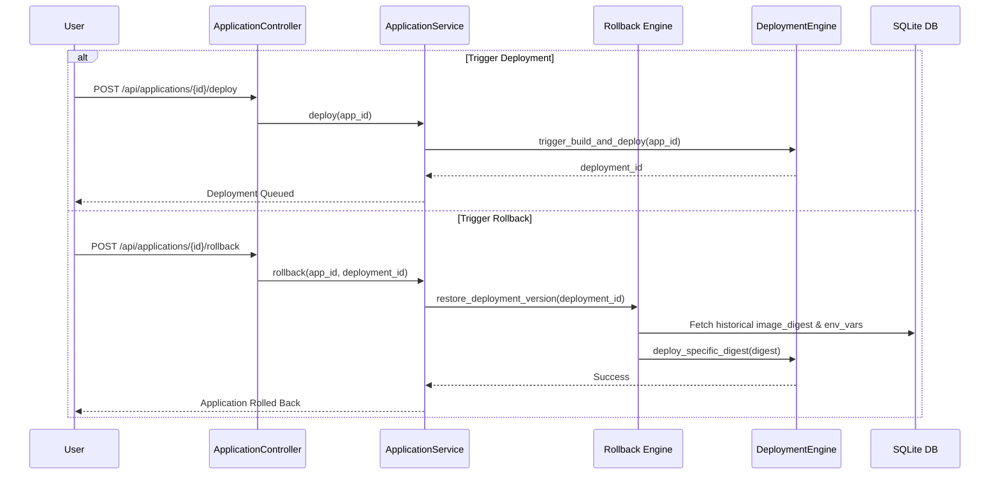

# Rustploy Application Service Architecture

The **Application Service** is the central component in Rustploy responsible for managing single-container workloads, source code build configurations, networking, routing, storage mounts, and deployment rollbacks.

---

## 1. Architecture Overview

```
                          ┌───────────────────────────┐
                          │   ApplicationController   │
                          │   (/api/applications)     │
                          └─────────────┬─────────────┘
                                        │
                                        ▼
                          ┌───────────────────────────┐
                          │    ApplicationService     │
                          └─────────────┬─────────────┘
                                        │
      ┌──────────────────┬──────────────┼──────────────┬──────────────────┐
      ▼                  ▼              ▼              ▼                  ▼
┌──────────────┐ ┌──────────────┐ ┌───────────┐ ┌──────────────┐ ┌────────────────┐
│   Source &   │ │ Middleware & │ │ Storage & │ │ Operations & │ │ Rollback Engine│
│ Build Engine │ │ Traefik Router│ │ Ports     │ │ Lifecycle    │ │ (Version History│
└──────────────┘ └──────────────┘ └───────────┘ └──────────────┘ └────────────────┘
```

---

## 2. Detailed Internal Working Mechanism

The Application Service operates through a strict 5-phase lifecycle:

```
[1. Application Create]  ──► DB Entry + Env Vars + Ports + Storage Mounts Set.
                                │
[2. Deploy Triggered]    ──► Git Clone ──► Build (Dockerfile / Nixpacks / Image Pull)
                                │
[3. Immutable Digest]    ──► Image SHA256 Digest Save (Version History for Rollback)
                                │
[4. Container Launch]    ──► Docker Run + Env Injection + Volume Mount + Health Probes
                                │
[5. Traefik Routing]     ──► Dynamic Domain Routing + SSL Certs + Middlewares (Zero Downtime)
```

### Phase 1: Creation & Configuration (`crud.rs`)
1. The user inputs Name, Source Type (`DOCKERFILE`, `NIXPACKS`, or `IMAGE`), Git Repo URL, Target Environment, and Server Node.
2. `ApplicationService` writes the primary record to the `applications` table.
3. Configures associated Port Mappings (`application_ports`), Storage Mounts (`application_mounts`), Environment Variables, and Traefik Middlewares (`application_middlewares`).

### Phase 2: Source Fetch & Build Strategy (`source.rs` & `crates/builder`)
When a deployment is triggered:
1. **Git Fetch**: The server fetches the target branch (`main` / `prod`) from the linked Git Provider (GitHub, GitLab, Gitea, Bitbucket).
2. **Build Strategy**:
   - **`DOCKERFILE`**: Executes `docker build -f Dockerfile -t app_{id}:{commit_sha} .`.
   - **`NIXPACKS`**: Auto-detects runtime (Node.js, Python, Rust, Go, PHP, Java) and builds a zero-config optimized image using Nixpacks.
   - **`IMAGE`**: Pulls pre-built image from Docker Hub or a private registry.
3. **Immutable Digest Capture**: Captures the exact `sha256:digest` hash of the built image and records it in `deployments.image_digest` for version history tracking.

### Phase 3: Container Launch & Network Binding (`remote.rs` & `operations.rs`)
1. **Network Attachment**: Container joins Rustploy's internal Docker Mesh Network (`rustploy-network`).
2. **Environment & Volume Injection**: Attaches persistent Docker volumes (`rustploy-data:/app/data`) and injects decrypted environment variables (`DATABASE_URL`, `JWT_SECRET`).
3. **Container Boot**: Launches container via Docker API with `RestartPolicy::Always`.

### Phase 4: Dynamic Traefik Reverse Proxy Routing (`traefik.rs`)
Once the container passes health checks:
1. **Domain Route Rule**: Generates router rule `Host("myapp.domain.com")`.
2. **Service Target**: Points Traefik internal load balancer to the container's internal IP and port (`http://10.200.0.x:3000`).
3. **TLS Certificates**: Provisions Let's Encrypt ACME SSL certificates.
4. **Zero-Downtime Reload**: Traefik hot-reloads routing configurations without dropping active HTTP connections.

### Phase 5: Atomic Rollback Mechanism (`rollback.rs`)
If a new release causes issues or crashes in production:
1. The user requests a **Rollback to Deployment #12**.
2. The `Rollback Engine` retrieves the historical `image_digest` (`sha256:a1b2c3d4...`) and environment variables from Deployment #12.
3. Swaps the running container target back to the historical digest without needing to re-clone or re-compile source code.
4. Hot-reloads Traefik routes to restore the previous working application version in under 2 seconds.

---

## 3. Storage, Ports & Traefik Middlewares

### 3.1 Port Configurations (`port.rs`)
- Maps host ports to container ports (`HTTP`, `TCP`, `UDP`).
- Configures publish modes (`Ingress` mesh vs `Host` direct).

### 3.2 Storage Mounts (`mount.rs`)
- **Volume Mounts**: Named Docker volumes persistent across container restarts (`rustploy-data:/app/data`).
- **Bind Mounts**: Direct host file/directory mounts.

### 3.3 Traefik Middlewares (`middleware.rs`)
Integrates directly with Traefik reverse proxy:
- `BasicAuth`: HTTP Basic Authentication credentials.
- `RateLimit`: Requests per second throttling.
- `Redirect`: HTTP to HTTPS or domain redirect rules.
- `CustomHeaders`: Security headers (HSTS, CORS, CSP).

---

## 4. Database Schema & Models

### 4.1 `applications` Table
Primary application record.
- `id` (INTEGER PRIMARY KEY)
- `name` (TEXT NOT NULL)
- `description` (TEXT NULLABLE)
- `source_type` (TEXT NOT NULL): `'DOCKERFILE'`, `'NIXPACKS'`, `'IMAGE'`, `'GIT'`.
- `repository` (TEXT NULLABLE): Git repository URL.
- `branch` (TEXT NULLABLE): Target branch (default `'main'`).
- `dockerfile_path` (TEXT DEFAULT `'Dockerfile'`).
- `environment_id` (INTEGER REFERENCES environments(id)).
- `server_id` (INTEGER NULLABLE REFERENCES servers(id)).
- `app_status` (TEXT DEFAULT `'STOPPED'`): `'RUNNING'`, `'STOPPED'`, `'DEPLOYING'`, `'FAILED'`.
- `created_at` (INTEGER DEFAULT (unixepoch())).

### 4.2 Associated Detail Tables
- `application_ports`: Container port mappings.
- `application_mounts`: Persistent volume & bind mounts.
- `application_middlewares`: Traefik middleware attachments.
- `application_redirects`: Route redirection rules.

---

## 5. Application Deployment & Rollback Sequence


