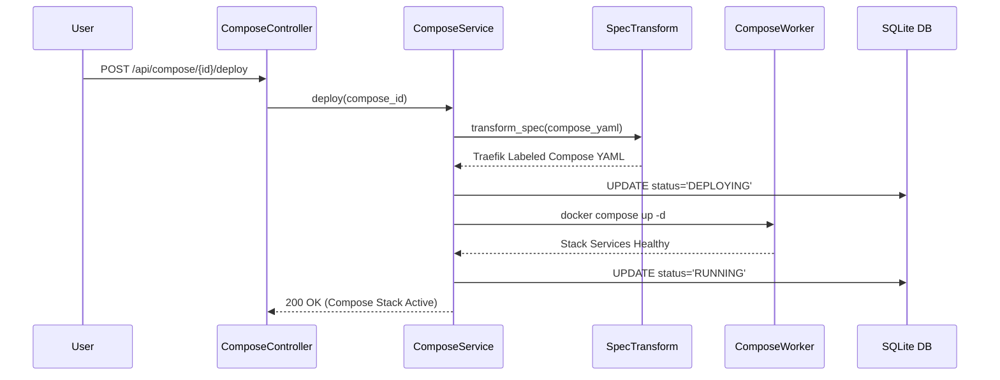

# Rustploy Docker Compose Service Architecture

The **Compose Service** in Rustploy provides multi-container stack orchestrations, handling `docker-compose.yml` parsing, resource modifications, Git synchronization, and stack lifecycle management.

---

## 1. Architecture Overview

```
                          ┌───────────────────────────┐
                          │     ComposeController     │
                          │     (/api/compose)        │
                          └─────────────┬─────────────┘
                                        │
                                        ▼
                          ┌───────────────────────────┐
                          │      ComposeService       │
                          └─────────────┬─────────────┘
                                        │
      ┌──────────────────┬──────────────┼──────────────┬──────────────────┐
      ▼                  ▼              ▼              ▼                  ▼
┌──────────────┐ ┌──────────────┐ ┌───────────┐ ┌──────────────┐ ┌────────────────┐
│ Source & YAML│ │ Resource     │ │ Operations│ │ Traefik Multi│ │ Background     │
│ Parser       │ │ Management   │ │ Lifecycle │ │ Router       │ │ Auto Executer  │
└──────────────┘ └──────────────┘ └───────────┘ └──────────────┘ └────────────────┘
```

---

## 2. Detailed Internal Working Mechanism

The Compose Service executes through 5 distinct async execution phases:

```
[1. Stack Create]   ──► DB Entry + Compose YAML Definition Parse + Env Vars Set
                             │
[2. Source Sync]    ──► Git Repo Clone / Raw YAML Validation / Spec Parsing
                             │
[3. Spec Transform] ──► Inject Traefik Labels + Attach Network Mesh + Volume Bindings
                             │
[4. Stack Deploy]   ──► Execution: `docker compose up -d` ──► Health Probes
                             │
[5. Traefik Swap]   ──► Multi-Service Domain Routers Registered ──► Stack Active
```

### Phase 1: Stack Creation & Configuration (`crud.rs`)
1. User provides Compose Stack Name, Target Environment, Server Node, and Compose Source (Raw YAML string or Git Repository).
2. `ComposeService` parses the specification and writes primary records into `compose_projects` table.

### Phase 2: Source Sync & Spec Parsing (`source/`)
1. Fetches compose definition from inline YAML or Git provider (`GitHub`, `GitLab`, `Gitea`, `Bitbucket`).
2. Validates compose syntax (services, volumes, networks, environment files).

### Phase 3: Spec Transformation (`management/`)
Before execution, Rustploy transforms the raw `docker-compose.yml`:
1. **Network Attachment**: Injects internal Docker mesh network (`rustploy-network`).
2. **Traefik Label Injection**: Automatically generates dynamic Traefik routing labels (`traefik.http.routers.<service>.rule=Host(...)`) for exposed web services.
3. **Volume & Env Injection**: Injects decrypted environment variables and persistent volume paths.

### Phase 4: Stack Lifecycle Execution (`operations.rs`)
Invokes multi-container execution:
- **`Deploy`**: Runs `docker compose up -d --build`, launching container services in dependency order.
- **`Stop`**: Runs `docker compose stop`.
- **`Down`**: Runs `docker compose down` (stops and removes containers/networks).
- **`Restart`**: Runs `docker compose restart`.

### Phase 5: Multi-Service Traefik Routing & Monitoring (`remote.rs`)
1. Detects exposed web services within the stack.
2. Registers multi-service Traefik HTTP/HTTPS domain routes.
3. Provisions Let's Encrypt SSL certificates.

---

## 3. Database Schema & Models

### 3.1 `compose_projects` Table
Primary Docker Compose project record.
- `id` (INTEGER PRIMARY KEY)
- `name` (TEXT NOT NULL)
- `description` (TEXT NULLABLE)
- `compose_file` (TEXT NOT NULL): Raw `docker-compose.yml` string.
- `source_type` (TEXT NOT NULL): `'RAW'`, `'GIT'`.
- `environment_id` (INTEGER REFERENCES environments(id)).
- `server_id` (INTEGER NULLABLE REFERENCES servers(id)).
- `status` (TEXT DEFAULT `'STOPPED'`): `'RUNNING'`, `'STOPPED'`, `'DEPLOYING'`, `'FAILED'`.
- `created_at` (INTEGER DEFAULT (unixepoch())).

---

## 4. Execution Sequence Diagram


