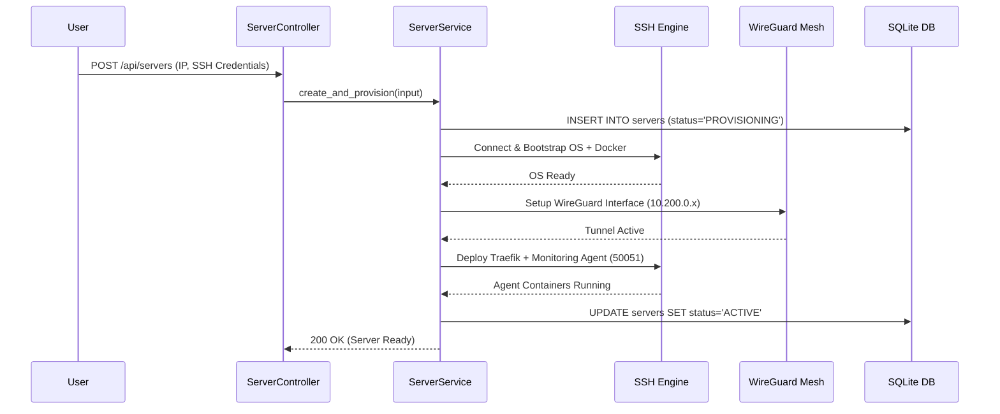

# Rustploy Server Management Architecture

The **Server Service** manages remote VPS nodes, SSH authentication, automated node provisioning, WireGuard private mesh networks, Docker daemon setup, and node garbage collection.

---

## 1. Architecture Overview

```
                          ┌───────────────────────────┐
                          │     ServerController      │
                          │     (/api/servers)        │
                          └─────────────┬─────────────┘
                                        │
                                        ▼
                          ┌───────────────────────────┐
                          │       ServerService       │
                          └─────────────┬─────────────┘
                                        │
      ┌──────────────────┬──────────────┼──────────────┬──────────────────┐
      ▼                  ▼              ▼              ▼                  ▼
┌──────────────┐ ┌──────────────┐ ┌───────────┐ ┌──────────────┐ ┌────────────────┐
│ Remote Node  │ │ WireGuard    │ │ Traefik   │ │ Monitoring   │ │ Docker & OS    │
│ Provisioning │ │ Private Mesh │ │ Reverse   │ │ Agent        │ │ Cleanup        │
│ (SSH Engine) │ │ (10.200.0.x) │ │ Proxy     │ │ (gRPC Node)  │ │ Garbage Collect│
└──────────────┘ └──────────────┘ └───────────┘ └──────────────┘ └────────────────┘
```

---

## 2. Detailed Internal Working Mechanism

Server Provisioning executes through 5 distinct async execution phases:

```
[1. Node Register]  ──► DB Entry + SSH Credentials / Key Pair Handshake
                             │
[2. OS Bootstrap]   ──► System Update ──► Docker Installation ──► Security Hardening
                             │
[3. Mesh Tunnel]    ──► WireGuard Interface (`wg0`) ──► Private IP (`10.200.0.x`) Assigned
                             │
[4. Stack Deploy]   ──► Deploy Traefik Reverse Proxy ──► Deploy Monitoring Agent (50051)
                             │
[5. Health Activation]──► Node Status Updated to 'ACTIVE' ──► Server Ready for Workloads
```

### Phase 1: Registration & SSH Handshake (`remote_server.rs`)
1. User provides Server Name, IP Address, SSH Port (default `22`), Username (`root`), and Password / SSH Key.
2. `ServerService` establishes an SSH handshake, testing connectivity and privilege escalation permissions.

### Phase 2: OS Bootstrapping & Security Hardening (`setup/server.rs`)
Invokes automated system setup commands over SSH:
1. Performs system package updates (`apt-get update` / `yum update`).
2. Installs Docker Engine & Docker Compose Plugin.
3. Sets up firewall rules (`ufw` / `iptables`) exposing required ingress ports (80, 443, 50051).

### Phase 3: WireGuard Private Mesh Network (`private_network/`)
1. Generates WireGuard key pairs (Private Key & Public Key).
2. Assigns a unique private mesh IP within the `10.200.0.x` subnet.
3. Provisions WireGuard kernel interface (`wg0`), enabling encrypted node-to-node communication.

### Phase 4: Traefik & Monitoring Agent Deployment (`remote_server.rs`)
1. **Traefik Reverse Proxy**: Launches edge proxy container to handle HTTP/HTTPS ingress routing and Let's Encrypt TLS certificates.
2. **Monitoring Agent**: Launches `rustploy-agent` container on port `50051`, passing `SERVER_ID` and `METRICS_TOKEN` environment variables for gRPC metrics ingestion.

### Phase 5: Health Activation & Garbage Collection (`cleanup.rs`)
1. Performs health probe verifying gRPC agent connectivity.
2. Updates server status in SQLite to `'ACTIVE'`.
3. Configures background automated cleanup task (`cleanup.rs`) to prune dangling Docker images, stopped containers, and unused build caches.

---

## 3. Database Schema & Models

### 3.1 `servers` Table
Primary server node record.
- `id` (INTEGER PRIMARY KEY)
- `name` (TEXT NOT NULL)
- `ip_address` (TEXT NOT NULL)
- `ssh_port` (INTEGER DEFAULT 22)
- `user` (TEXT DEFAULT 'root')
- `status` (TEXT DEFAULT `'PROVISIONING'`): `'ACTIVE'`, `'PROVISIONING'`, `'UNREACHABLE'`, `'MAINTENANCE'`.
- `organization_id` (INTEGER REFERENCES organization(id)).
- `created_at` (INTEGER DEFAULT (unixepoch())).

### 3.2 `server_private_networks` Table
WireGuard mesh network configurations.
- `server_id` (INTEGER PRIMARY KEY REFERENCES servers(id))
- `private_ip` (TEXT NOT NULL UNIQUE): Assigned `10.200.0.x` IP.
- `public_key` (TEXT NOT NULL)
- `preshared_key` (TEXT NULLABLE)

---

## 4. Server Provisioning Sequence Diagram


