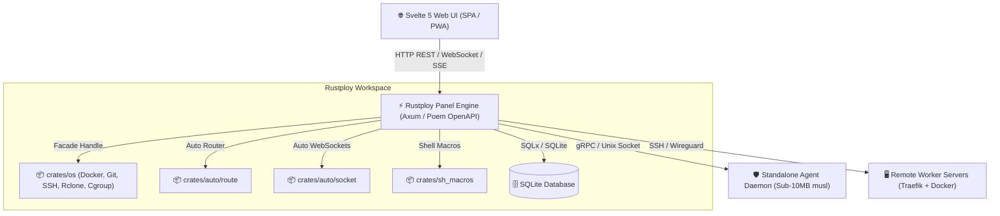

# 🚀 Rustploy

> **The Next-Generation, Blazing-Fast, Self-Hosted Cloud Control Panel & Deployment Engine.**  
> Effortlessly deploy applications, databases, Docker Compose stacks, and preview environments across multiple servers with zero configuration friction.

---


---

## 🌟 Why Rustploy?

Rustploy is designed from the ground up as an ultra-lightweight, high-throughput, self-hosted alternative to Vercel, Heroku, and Coolify. Built with **pure Rust** on the backend and **Svelte 5 Runes** on the frontend, Rustploy delivers instantaneous page transitions, sub-millisecond API response times, and minimal memory footprint.

Whether you're managing a single VPS or a distributed fleet of remote servers, Rustploy simplifies container orchestration, dynamic reverse proxy routing (via Traefik), automated SSL, and database management into a unified, intuitive dashboard.

---

## ✨ Key Features & Capabilities

### ⚡ 1. Universal Application Deployment
- **Multi-Build Engine**: Deploy directly from **Dockerfile**, **Nixpacks**, **Railpack**, **Heroku Buildpacks**, or static SPA files.
- **Git Provider Integration**: Native webhooks & OAuth integration for **GitHub**, **GitLab**, **Gitea**, and **Bitbucket**.
- **Preview Environments**: Automatically spin up isolated ephemeral preview deployments for pull requests & feature branches.
- **Live SSE Deployment Logs**: Stream real-time build and execution logs directly in your browser with zero latency.

### 🌐 2. Multi-Server & Overlay Networking
- **Seamless Server Connection**: Add and manage remote nodes over direct SSH or private WireGuard mesh networks.
- **Managed WireGuard Private Network**: Automatic IP allocation, encryption, health monitoring, and key rotation.
- **Server Audit & Auto-Repair**: One-click audit tool checks Docker, Swarm, open ports, system dependencies, and auto-repairs missing tools.

### 🔀 3. Automatic Reverse Proxy & SSL (Traefik)
- **Zero-Touch Routing**: Dynamic Traefik label generation for HTTP/HTTPS, custom ports, and path routing.
- **Automatic SSL/TLS**: Automated ACME certificates via Let's Encrypt, Cloudflare, or custom resolvers.
- **Wildcard Domains & Middleware**: Configure custom headers, rate limiting, and domain redirects out of the box.

### 🗄️ 4. Managed Database Provisioning & Backups
- **Supported Engines**: One-click setup for **PostgreSQL**, **MySQL**, **Redis**, **MongoDB**, and **ClickHouse**.
- **Automated S3/Rclone Backups**: Periodically back up database dumps and app volumes to AWS S3, Cloudflare R2, MinIO, or SFTP targets.
- **Replication & Topology**: Configure primary/replica topologies with automated failover tracking.

### 📊 5. Lightweight Real-Time Monitoring Agent
- **Sub-10MB Static Binary**: Standalone Rust agent compiled with `musl` targeting `< 10 MB` memory overhead.
- **Cgroup v2 & Metrics**: Direct Unix socket communication with Docker daemon to stream real-time CPU, RAM, Network I/O, and disk usage.
- **Proactive Alerts**: Custom alert triggers with multi-channel notifications (Telegram, Discord, Slack, Email, Webhooks).

### 🔍 6. Global Command Palette & Unified Management
- **Instant Search (`/global/search`)**: Instantly search servers, apps, databases, compose stacks, and environments in milliseconds.
- **Bulk Operations**: Bulk deploy, stop, or migrate dependencies across servers in a single click.
- **Role-Based Access Control (RBAC)**: Fine-grained user permissions, organization workspaces, and audit logs.

---

## 🏗️ Architecture Overview

Rustploy is designed as a modular workspace of decoupled crates to maximize code reuse, reliability, and security:



---

## 🛠️ Technology Stack

| Layer | Technology Used |
| :--- | :--- |
| **Backend Core** | Rust (Axum, Poem OpenAPI, Tokio, SQLx, Auto-DI) |
| **Frontend Framework** | Svelte 5 (Runes, TailwindCSS, Vite, Lucide Icons) |
| **Database** | SQLite3 (Embedded with automated migrations) |
| **Reverse Proxy** | Traefik v3 (Dynamic Docker Provider + ACME) |
| **Monitoring Agent** | Rust Static `x86_64-unknown-linux-musl` (< 10 MB image) |
| **Networking** | WireGuard, SSH (ssh2 / thrussh), TLS 1.3 |
| **Build Drivers** | Docker Engine API, Nixpacks, Railpack, Heroku |

---

## 🚀 Quick Start & Installation

### Option 1: One-Line Docker Run (Recommended)

Run the official Rustploy all-in-one container:

```bash
docker run -d \
  --name rustploy \
  --restart always \
  -p 3000:3000 \
  -v /var/run/docker.sock:/var/run/docker.sock \
  -v rustploy_data:/app/data \
  rustploy/rustploy:latest
```

Open your browser and navigate to `http://YOUR_SERVER_IP:3000` to complete the initial admin setup!

---

### Option 2: Docker Compose

Create a `docker-compose.yml` file:

```yaml
version: "3.8"

services:
  rustploy:
    image: rustploy/rustploy:latest
    container_name: rustploy
    restart: always
    ports:
      - "3000:3000"
    volumes:
      - /var/run/docker.sock:/var/run/docker.sock
      - rustploy_data:/app/data
    environment:
      - PORT=3000
      - HOST=0.0.0.0
      - DATABASE_URL=sqlite:///app/data/db.sqlite3

volumes:
  rustploy_data:
```

Run:
```bash
docker compose up -d
```

---

## 💻 Local Development Setup

### Prerequisites
- **Rust Toolchain**: 1.80+ (`rustup default stable`)
- **Node.js**: 22+ and `pnpm` (`corepack enable`)
- **SQLite3** & **Docker Engine**

### 1. Clone the Repository
```bash
git clone https://github.com/rustploy/rustploy.git
cd rustploy
```

### 2. Frontend Setup
```bash
cd web/rustploy
pnpm install
pnpm dev
```
The frontend dev server starts at `http://localhost:5173`.

### 3. Backend Setup
In the project root directory:
```bash
# Verify workspace compilation
cargo check --workspace

# Run the panel backend server
cargo run --bin rustploy
```
The backend API server starts at `http://localhost:3000`.

---

## 📚 Project Workspace Structure

```text
rustploy/
├── agent/                  # Standalone monitoring daemon (<10MB musl static binary)
├── crates/                 # Decoupled shared workspace crates
│   ├── os/                 # OS, Docker, Git, SSH, Rclone & Cgroup facade engine
│   ├── sh_macros/          # Shell execution proc-macros
│   ├── auto/
│   │   ├── route/          # Auto routing controller macro
│   │   └── socket/         # Auto WebSocket handler macro
├── db/                     # SQLx database schema migrations
├── src/                    # Panel Backend Core Application
│   ├── api/                # API DTOs & Handler Controllers (MVVM compliant)
│   ├── db/                 # SQLx Repositories & Models
│   ├── services/           # Business Services (application, compose, server, preview, etc.)
│   └── utils/              # Helper utilities & background workers
└── web/rustploy/           # Modern Svelte 5 Web UI
```

---

## 🛡️ Security & Privacy

- **100% Self-Hosted**: All data, credentials, and logs stay on your infrastructure. Zero external telemetries.
- **SSH Key Encryption**: Encrypted private key storage in SQLite DB.
- **Container Isolation**: Dedicated network isolation for applications and database containers.
- **WireGuard Overlay**: Node communications are encrypted end-to-end with curve25519 WireGuard tunnels.

---

## 📄 License

Distributed under the **MIT License**. See `LICENSE` for more information.

---

<p center>
Built with ❤️ by the <strong>Rustploy Team</strong> for developers who demand speed, control, and simplicity.
</p>
