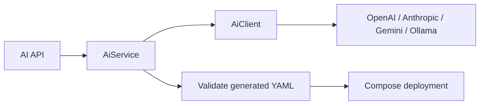
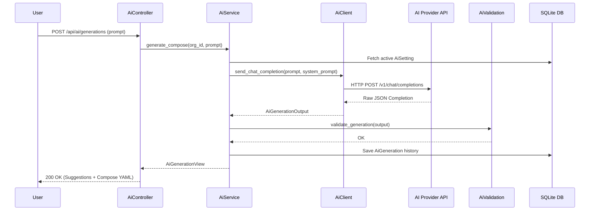

# OpenOxide AI Service Architecture

```text
┌─ AI REQUEST ─────────────────────────────────────────────┐
│ API → AiService → provider client → validation → compose │
│ Scope: organization + application                         │
│ Safety: YAML/port validation before deployment            │
└───────────────────────────────────────────────────────────┘
```



OpenOxide provides a multi-provider, organization-scoped **AI Engine** designed to generate Docker Compose stacks, diagnose build/runtime errors, and perform one-click AI application deployments.

---

## 1. Architecture Overview

```
                          ┌───────────────────────┐
                          │   Axum Controller     │
                          │ (/api/ai/generations) │
                          └───────────┬───────────┘
                                      │
                                      ▼
                          ┌───────────────────────┐
                          │       AiService       │
                          └───────────┬───────────┘
                                      │
           ┌──────────────────────────┼──────────────────────────┐
           ▼                          ▼                          ▼
┌────────────────────┐     ┌────────────────────┐     ┌────────────────────┐
│   AiClient         │     │  AiValidation      │     │  ComposeService    │
│ (HTTP Provider SDK)│     │ (YAML/Port Guard)  │     │ (Deployment Engine)│
└──────────┬─────────┘     └────────────────────┘     └────────────────────┘
           │
           ├──────────────────────────┬──────────────────────────┬──────────────────────────┐
           ▼                          ▼                          ▼                          ▼
  ┌─────────────────┐        ┌─────────────────┐        ┌─────────────────┐        ┌─────────────────┐
  │     OpenAI      │        │    Anthropic    │        │  Google Gemini  │        │  Ollama / Local │
  └─────────────────┘        └─────────────────┘        └─────────────────┘        └─────────────────┘
```

---

## 2. Detailed Internal Working Mechanism

The AI Service operates through a strict 5-phase async pipeline:

```
[1. Prompt Ingestion]  ──► Natural Language Prompt + System Prompt Assembly
                             │
[2. Provider Detect]   ──► AiProviderKind Detection (OpenAI / Anthropic / Gemini / Ollama)
                             │
[3. Completion Dispatch]──► HTTP Chat Completion API Request ──► Raw Response Parsing
                             │
[4. Security Guard]    ──► YAML Syntax Check ──► Host Mount / Port / Env Validation
                             │
[5. One-Click Deploy]  ──► DB History Saved ──► Auto-Provision Compose Project & Deploy
```

### Phase 1: Prompt Ingestion & Context Assembly (`prompts.rs`)
1. Receives natural language user query (e.g. *"Deploy a Django app with PostgreSQL and Redis"*).
2. `prompts.rs` injects system prompt constraints demanding strict JSON output schemas (`AiGenerationOutput`).

### Phase 2: Provider Auto-Detection & Config (`provider.rs`)
1. `AiProviderKind::detect` inspects the target API URL:
   - `anthropic.com` $\rightarrow$ Anthropic Claude Messages API.
   - `generativelanguage.googleapis.com` $\rightarrow$ Google Gemini API.
   - `localhost:11434` / `ollama` $\rightarrow$ Ollama Local Native API.
   - `api.openai.com` / custom $\rightarrow$ OpenAI Chat Completions API.

### Phase 3: Completion Dispatch & Response Parsing (`client.rs`)
1. Sends authenticated HTTP POST request to the provider's completion endpoint.
2. Extracts JSON output string and parses it into structured structs:
   - `AiComposeSuggestion`: Generated `docker-compose.yml`, extracted environment variables (`AiEnvironmentVariable`), domain routes (`AiDomain`), and configuration files (`AiGeneratedFile`).

### Phase 4: Strict Security & Syntax Validation (`validation.rs`)
Before any AI output is accepted:
1. **YAML Verification**: Parses YAML with `serde_yaml` to prevent syntax crashes.
2. **Security Guard**: Rejects dangerous host bind mounts (`/var/run/docker.sock`, `/etc`, `/usr`).
3. **Port & Env Checking**: Verifies port formats and ensures all referenced environment variables are defined.

### Phase 5: One-Click Compose Deployment Automation (`service.rs`)
1. Saves query history to SQLite `ai_generations` table.
2. When user clicks **"Deploy AI Stack"**:
   - Creates a new Compose Project in the target environment via `ComposeService::create`.
   - Provisions domain routes (`DomainService`) and volume mounts.
   - Triggers automatic background deployment (`ComposeOperation::Deploy`).

---

## 3. Multi-Provider Support (`AiProviderKind`)

OpenOxide automatically detects provider types based on URL patterns:

- **OpenAI**: `https://api.openai.com` (`gpt-4o`, `gpt-4o-mini`).
- **Anthropic**: `https://api.anthropic.com` (`claude-3-5-sonnet`, `claude-3-haiku`).
- **Google Gemini**: `https://generativelanguage.googleapis.com` (`gemini-1.5-pro`, `gemini-1.5-flash`).
- **Ollama**: `http://localhost:11434` or custom Ollama URL (Self-hosted local AI models like `llama3`, `mistral`, `deepseek-r1`).
- **OpenAI-Compatible**: Any custom endpoint implementing OpenAI Chat Completions (Groq, Together.ai, OpenRouter, vLLM, LocalAI).

---

## 4. Core AI Capabilities

### 4.1 AI Stack Generation (`generate_compose`)
Converts natural language user prompts into structured infrastructure:
- Validated `docker-compose.yml` string.
- Extracted Environment Variables (`AiEnvironmentVariable`).
- Domain Routing Configurations (`AiDomain`).
- Additional Config Files (`AiGeneratedFile`).

### 4.2 Log Analysis & Error Diagnosis (`analyze_logs`)
Analyzes raw logs to detect failure root causes and suggest fix steps:
- **Build Logs (`AiLogContext::Build`)**: Diagnoses Dockerfile syntax errors, missing dependencies, or compile failures.
- **Runtime Logs (`AiLogContext::Runtime`)**: Diagnoses database connection timeouts, memory OOM crashes, or port binding issues.

### 4.3 One-Click AI Deploy (`deploy_suggestion`)
Converts an AI suggestion into a live deployment:
1. Validates generated Compose YAML and environment variables.
2. Creates a Compose Project in the database (`ComposeService::create`).
3. Provisions required domain routes and volume mounts.
4. Triggers automatic background deployment (`ComposeOperation::Deploy`).

---

## 5. Strict Validation & Security (`validation.rs`)

Before any AI-generated stack is accepted or deployed, it passes through strict security and syntax validation:

1. **YAML Syntax Verification**: Parses generated YAML using `serde_yaml` to prevent malformed syntax.
2. **Dangerous Mount Protection**: Blocks host mount paths that jeopardize server security (e.g., `/var/run/docker.sock`, `/etc`, `/usr`).
3. **Port Binding Validation**: Verifies host and container port formats.
4. **Environment Variable Reference Check**: Ensures all referenced environment variables are defined.

---

## 6. Database Schema & Models

### 6.1 `ai_settings` Table
Stores organization-scoped provider configurations.
- `id` (INTEGER PRIMARY KEY)
- `name` (TEXT NOT NULL): Display label (e.g., "Production Claude 3.5").
- `api_url` (TEXT NOT NULL): Endpoint URL.
- `api_key` (TEXT NOT NULL): Encrypted API Key.
- `model` (TEXT NOT NULL): Target model identifier (e.g., `gpt-4o`).
- `is_enabled` (INTEGER DEFAULT 1): Active status.
- `organization_id` (INTEGER REFERENCES organization(id)).

### 6.2 `ai_generations` Table
Stores historical prompt outputs and deployment tracking.
- `id` (INTEGER PRIMARY KEY)
- `ai_setting_id` (INTEGER REFERENCES ai_settings(id))
- `organization_id` (INTEGER REFERENCES organization(id))
- `created_by` (INTEGER REFERENCES users(id))
- `prompt` (TEXT NOT NULL): Original user query.
- `output` (TEXT NOT NULL): JSON-serialized `AiGenerationOutput`.
- `status` (TEXT NOT NULL): `'PENDING'`, `'COMPLETED'`, `'FAILED'`.
- `compose_id` (INTEGER NULLABLE REFERENCES compose_projects(id)).

---

## 7. Request Sequence Diagram

## 8. How the AI layer is implemented

OpenOxide uses Rig as the provider abstraction rather than hand-writing each raw completion protocol. `AiClient` selects the configured provider/base URL/model and builds the corresponding Rig client. Organization-scoped settings and generations are read/written through repositories.

Model output is treated as untrusted text. Compose extraction removes prose/code fences, parses YAML, validates service structure and exposed ports, and only then hands the suggestion to `ComposeService`. Deploying an AI suggestion therefore uses the same permission, persistence, queue, remote execution, logging, and cancellation path as a manually authored Compose project.

Provider/network errors remain generation failures and cannot mutate deployment state before validation succeeds.


