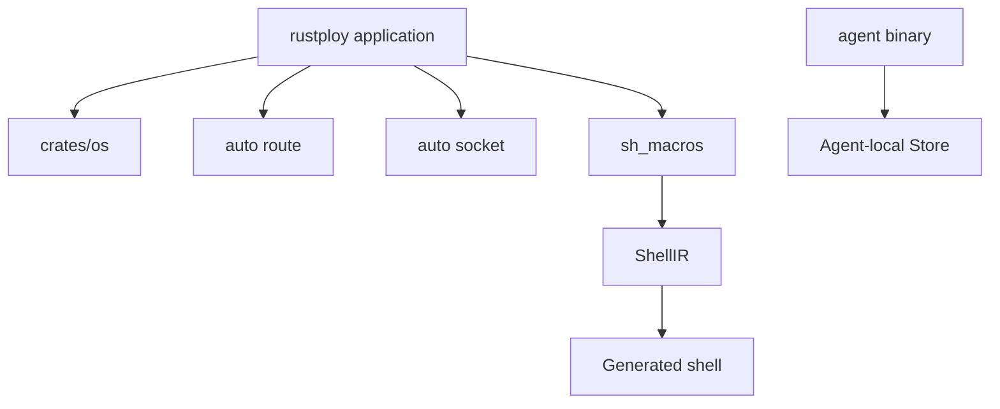

# Rustploy Custom Crates & Macro System Architecture

```text
┌─ WORKSPACE ───────────────────────────────────────────────┐
│ rustploy app ──► crates/os ──► typed command builders      │
│      │             │                                        │
│      ├─ auto/route ─► controller registration               │
│      ├─ auto/socket ─► realtime socket registration          │
│      └─ sh_macros ──► ShellIR ──► POSIX shell script         │
│ agent ──► independent monitoring binary + local Store       │
└─────────────────────────────────────────────────────────────┘
```



This document details the custom workspace crates, procedural macros, and declarative macro DSLs built specifically for Rustploy.

---

## 1. Custom Workspace Crates

```
Rustploy Workspace Root
├── src/                          ► Core API, Handlers, Services, Repositories
├── crates/
│   ├── auto/
│   │   ├── route/                ► Controller Auto-Registration Engine
│   │   └── route_macros/         ► Proc-Macro Attribute Parsers (#[controller], #[get], #[post])
│   ├── builder/                  ► Spec Parsing, Dockerfile Generator, Nixpacks Engine, ApplicationState
│   └── os/                       ► System Abstraction, Package Manager, WireGuard Mesh, Script Macros DSL
```

---

## 2. Macro Systems & DSL Breakdown

### 2.1 Auto-Routing Proc-Macro (`crates/auto/route_macros`)
Allows declaring controller endpoints with zero boilerplate:

```rust
#[controller("/api/applications")]
impl ApplicationController {
    #[get("/:id")]
    async fn get_by_id(&self, Path(id): Path<i64>) -> Result<...> { ... }
}
```
- **How It Works**: Proc-macro inspects `#[controller]` and `#[get]`/`#[post]`/`#[put]`/`#[delete]`, automatically generating Axum `Router` bindings and Dependency Injection constructors.

---

### 2.2 Shell Execution Pipeline DSL (`crates/os/src/exec/script/macros.rs`)
Declarative macros providing a type-safe Bash-like syntax inside Rust for system commands, conditional checks, and pipeline chaining:

#### A. Condition Evaluation (`cond!`)
```rust
let is_ready = cond!(dir("/var/lib/docker") && ! file("/tmp/lock"));
```
- Evaluates directory checks (`dir`), file checks (`file`), command execution success (`cmd`), and environment variables (`env`) with short-circuiting `&&` and `||` logic.

#### B. Pipeline Builder (`pipeline!`)
```rust
let p = pipeline! {
    cmd("docker build -t app:latest .");
    pipe("docker push app:latest");
};
```
- Chains shell commands and handles stdout/stderr streaming securely using `shell_single_quote` escaping.

---

### 2.3 Compile-Time Permission Rules (`src/core/middleware/permission/rules.rs`)
Uses macro-based zero-sized trait markers (`Allows<O>`) to enforce valid resource/operation pairs at compile time:

```rust
macro_rules! allow {
    ($resource:ty: $($operation:ty),+ $(,)?) => {
        $(impl Allows<$operation> for $resource {})+
    };
}

allow!(Application: CanRead, CanCreate, CanUpdate, CanDelete, CanDeploy, CanMonitor);
```
- **Compile-Time Safety**: Invalid permissions (e.g. `RequirePermission<AuditLog, CanDeploy>`) fail to compile immediately.

---

### 2.4 Enum Generator (`crates/os/src/macros/string_enum.rs`)

## 3. How the generated shell remains controllable

`sh!` parses Rust-like statements into `ShellIR`; builders such as `os.package(...).install()`, Docker builders, files, services, and networks implement the conversion needed by the DSL. `ScriptPipeline::compile` is the final renderer. This lets setup code be composed as typed operations while still producing one inspectable POSIX shell script for remote execution.

Rust `else if` is flattened into shell `elif`, variables are scope-checked, dynamic Rust values require explicit interpolation, and arguments are shell-quoted by the command representation. Snapshot/`sh -n` tests inspect the generated server setup script so macro changes cannot silently produce malformed provisioning commands.

Auto-route and auto-socket macros solve registration boilerplate only; business logic remains in handlers/services and SQL remains in repositories.
Generates string-backed Rust enums with `as_str()`, `FromStr`, `Display`, `Serialize`, and `Deserialize`:

```rust
string_enum!(
    pub enum GitProviderType {
        Github => "GITHUB",
        Gitlab => "GITLAB",
        Gitea => "GITEA",
        Bitbucket => "BITBUCKET",
    }
);
```
