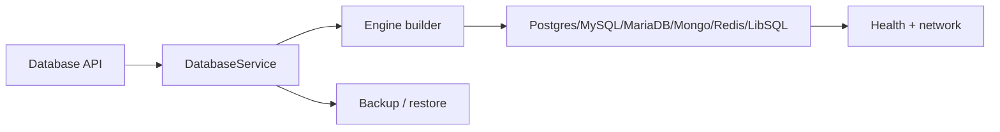
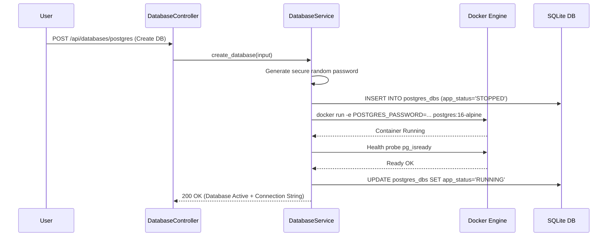

# Rustploy Database Service Architecture

```text
┌─ DATABASE ────────────────────────────────────────────────┐
│ request → engine builder → credentials → container        │
│ health/network checks run after provisioning               │
│ backup/restore uses the engine-specific repository         │
└───────────────────────────────────────────────────────────┘
```



The **Database Service** in Rustploy provides automated provisioning, lifecycle management, user credential generation, and networking for 6 managed database engines (`POSTGRES`, `MYSQL`, `MARIADB`, `MONGO`, `REDIS`, `LIBSQL`).

---

## 1. Architecture Overview

```
                          ┌───────────────────────────┐
                          │    DatabaseController     │
                          │   (/api/databases/...)    │
                          └─────────────┬─────────────┘
                                        │
                                        ▼
                          ┌───────────────────────────┐
                          │      DatabaseService      │
                          └─────────────┬─────────────┘
                                        │
      ┌──────────────────┬──────────────┼──────────────┬──────────────────┐
      ▼                  ▼              ▼              ▼                  ▼
┌──────────────┐ ┌──────────────┐ ┌───────────┐ ┌──────────────┐ ┌────────────────┐
│ Managed      │ │ Credentials  │ │ Network & │ │ Operations & │ │ Backup &       │
│ Engine Config│ │ & Secrets    │ │ Mesh      │ │ Health Probes│ │ Restore Engine │
└──────────────┘ └──────────────┘ └───────────┘ └──────────────┘ └────────────────┘
```

---

## 2. Detailed Internal Working Mechanism

The Database Service operates through 5 distinct execution phases:

```
[1. Provision Req]  ──► Engine Type Select ──► Password/User Auto-Gen ──► DB Record Created
                             │
[2. Storage Alloc]  ──► Docker Volume Attachment (`rustploy_db_data`) ──► Host Port Mapping
                             │
[3. Container Run]  ──► Engine Environment Injection (POSTGRES_PASSWORD, MYSQL_ROOT_PASSWORD)
                             │
[4. Network Mesh]   ──► Internal Mesh Attachment ──► Application Dependency Linking
                             │
[5. Health Probes]  ──► Engine Readiness Probe (pg_isready, redis-cli ping) ──► Active
```

### Phase 1: Engine Selection & Credential Generation (`crud.rs`)
1. User selects Engine (`Postgres`, `MySQL`, `MariaDB`, `Mongo`, `Redis`, `LibSQL`), Database Name, Target Environment, and Server Node.
2. System auto-generates secure random database usernames and passwords.
3. Writes primary metadata into engine-specific database tables (`postgres_dbs`, `mysql_dbs`, etc.).

### Phase 2: Storage Allocation & Port Mapping (`management.rs`)
1. Provisions named Docker volumes persistent across database container restarts (`rustploy-postgres-data:/var/lib/postgresql/data`).
2. Configures host port mappings and external access toggles.

### Phase 3: Container Environment Injection & Boot (`remote.rs`)
Launches target database Docker container with default or custom Docker images:
- **Postgres**: Injects `POSTGRES_DB`, `POSTGRES_USER`, `POSTGRES_PASSWORD`.
- **MySQL / MariaDB**: Injects `MYSQL_DATABASE`, `MYSQL_USER`, `MYSQL_PASSWORD`, `MYSQL_ROOT_PASSWORD`.
- **Mongo**: Injects `MONGO_INITDB_ROOT_USERNAME`, `MONGO_INITDB_ROOT_PASSWORD`.
- **Redis**: Injects `--requirepass <password>`.

### Phase 4: Network Linking & Dependency Binding (`database_network.rs`)
1. Attaches container to internal mesh network.
2. Links application workloads to the database instance, automatically populating `DATABASE_URL` environment variables in linked application containers.

### Phase 5: Health Probes & Backup Readiness (`operations.rs`)
1. Executes engine-specific health probes (`pg_isready` for Postgres, `redis-cli ping` for Redis, `mysqladmin ping` for MySQL).
2. Updates `app_status` to `'RUNNING'`.
3. Registers database target with automated backup schedule manager (`backup.rs`).

---

## 3. Supported Engines & Default Specs

| Engine | Default Docker Image | Default Port | Internal Health Check Command |
| :--- | :--- | :--- | :--- |
| **Postgres** | `postgres:16-alpine` | `5432` | `pg_isready -U <user>` |
| **MySQL** | `mysql:8.0` | `3306` | `mysqladmin ping -h localhost` |
| **MariaDB** | `mariadb:11` | `3306` | `mariadb-admin ping` |
| **Mongo** | `mongo:7` | `27017` | `mongosh --eval "db.adminCommand('ping')"` |
| **Redis** | `redis:7-alpine` | `6379` | `redis-cli ping` |
| **LibSQL** | `ghcr.io/tursodatabase/libsql-server` | `8080` | `curl -f http://localhost:8080/health` |

---

## 4. Execution Sequence Diagram

## 5. How managed databases are implemented

Each database type has a typed configuration/model but uses the shared database operation boundary. Creation generates credentials, stores metadata, validates server deployability, then constructs the engine-specific Docker configuration. Persistent volumes are created before the container so retries do not lose data.

Health and lifecycle actions are executed on the assigned server through the remote executor and Docker builders. The application network binding is explicit, and backup code calls the correct native dump/restore tool for the selected engine instead of treating every database as a filesystem archive.

Deleting metadata and deleting storage are intentionally distinct risks; destructive actions must resolve the exact database/container/volume target first.


