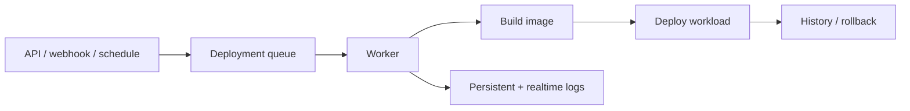
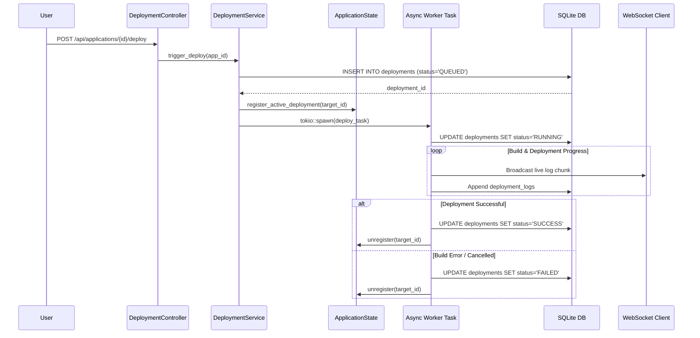

# OpenOxide Deployment Engine Architecture

```text
┌─ DEPLOYMENT ──────────────────────────────────────────────┐
│ trigger → queue → build/deploy worker → log stream         │
│ concurrency is controlled per server/resource              │
│ final state: success, failed, cancelled, or rolled back    │
└───────────────────────────────────────────────────────────┘
```



OpenOxide features an asynchronous, queue-backed **Deployment Engine** responsible for building Docker images, managing Docker Compose stacks, deploying databases, and streaming real-time deployment logs.

---

## 1. Architecture Overview

```
                        ┌───────────────────────────────┐
                        │   Deployment Trigger (API/    │
                        │   Git Webhook / Auto-Deploy)  │
                        └───────────────┬───────────────┘
                                        │
                                        ▼
                        ┌───────────────────────────────┐
                        │       DeploymentService       │
                        └───────────────┬───────────────┘
                                        │
        ┌───────────────────────────────┼───────────────────────────────┐
        ▼                               ▼                               ▼
┌───────────────────────┐   ┌───────────────────────┐   ┌───────────────────────┐
│ DeploymentRepository  │   │   ApplicationState    │   │  Log Stream Manager   │
│ (SQLite Queue State)  │   │  (Active Task Registry│   │ (Broadcaster / File)  │
└───────────────────────┘   └───────────┬───────────┘   └───────────────────────┘
                                        │
             ┌──────────────────────────┼──────────────────────────┐
             ▼                          ▼                          ▼
   ┌───────────────────┐      ┌───────────────────┐      ┌───────────────────┐
   │ Application Deploy│      │  Compose Deploy   │      │  Database Deploy  │
   │ (Dockerfile/Nix)  │      │ (Multi-Container) │      │ (Postgres/Redis)  │
   └───────────────────┘      └───────────────────┘      └───────────────────┘
```

---

## 2. Detailed Internal Working Mechanism

The Deployment Engine executes through 5 distinct async execution phases:

```
[1. Queue & Claim]  ──► DB Queue Insertion ('QUEUED') ──► Worker Claims Slot ('RUNNING')
                             │
[2. State Init]     ──► ApplicationState Task Token & Cancellation Channel Created
                             │
[3. Build Exec]     ──► Docker/Nixpacks Compilation ──► Live WS Log Broadcasting
                             │
[4. Health Probe]   ──► Container Start ──► Port Health Check ──► Traefik Swap
                             │
[5. Audit & Finish] ──► Status Updated ('SUCCESS' / 'FAILED') ──► Task Unregistered
```

### Phase 1: Queue & Claim (`DeploymentRepository`)
1. An event (API request, Git Webhook, or Scheduled Trigger) invokes `DeploymentService`.
2. A deployment row is created in SQLite database with `status = 'QUEUED'`.
3. Worker execution task claims the deployment slot, updating status to `RUNNING` and recording start time.

### Phase 2: State Initialization (`ApplicationState`)
1. The deployment component target (`IdType::AppId`, `IdType::ComposeId`, or `IdType::DatabaseId`) is registered in global `ApplicationState`.
2. Creates an in-memory cancellation token (`CancellationToken`) and log broadcast channel (`tokio::sync::broadcast`).

### Phase 3: Build Execution & Live Log Streaming (`log.rs` & `docker.rs`)
1. Executes source compilation (Git clone, Dockerfile build, Nixpacks runtime build, or Compose YAML parse).
2. Captures stdout/stderr chunks in real-time.
3. Broadcasts log chunks live over WebSockets to connected panel clients (`subscribe_component`).
4. Persists execution logs into SQLite `deployment_logs` table.

### Phase 4: Health Probing & Zero-Downtime Routing (`traefik.rs`)
1. Provisions container with environment variables, secrets, and persistent storage volumes.
2. Starts container and performs TCP/HTTP health probes on internal container port.
3. Once health probes pass, signals Traefik reverse proxy to swap HTTP router traffic to the new container.

### Phase 5: Completion & Cancellation Handling (`service.rs`)
1. On success: Updates status to `'SUCCESS'`, updates component `app_status` to `'RUNNING'`, and unregisters task from `ApplicationState`.
2. On failure: Updates status to `'FAILED'`, records error traceback in logs, and maintains previous container state.
3. On manual cancellation: `cancel_by_id(target_id)` triggers the Tokio cancellation token, immediately killing active subprocesses and setting status to `'CANCELLED'`.

---

## 3. Deployment Target Types

The deployment engine handles 3 distinct component target types (`IdType`):

1. **Applications (`IdType::AppId`)**: Single-container workloads built from Dockerfiles, Nixpacks, or pre-built Docker images, hooked up to domain routers and volume mounts.
2. **Compose Projects (`IdType::ComposeId`)**: Multi-container Docker Compose stacks managed via custom YAML definitions and environment files.
3. **Databases (`IdType::DatabaseId`)**: Managed database instances (`POSTGRES`, `MYSQL`, `MARIADB`, `MONGO`, `REDIS`, `LIBSQL`) with automated volume provisioning and health probes.

---

## 4. Deployment Lifecycle States

Every deployment transitions through a strict state machine:

```
  ┌──────────┐      Start      ┌──────────┐      Finish      ┌──────────┐
  │  QUEUED  │ ──────────────► │ RUNNING  │ ───────────────► │ SUCCESS  │
  └────┬─────┘                 └────┬─────┘                  └──────────┘
       │                            │
       │ Cancel                     │ Error / Cancel
       ▼                            ▼
  ┌──────────┐                 ┌──────────┐
  │CANCELLED │                 │  FAILED  │
  └──────────┘                 └──────────┘
```

1. **`QUEUED`**: The deployment request is written to the database queue waiting for a worker execution slot.
2. **`RUNNING`**: Worker claims the deployment slot, allocates a process execution token, and starts building/deploying.
3. **`SUCCESS`**: Build & health check probes passed; traffic is routed to the new container.
4. **`FAILED`**: Build, compilation, or container health check failed; deployment status updated with error traceback.
5. **`CANCELLED`**: User manually cancelled the queued or active deployment.

---

## 5. Database Schema & Models

### 5.1 `deployments` Table
Stores deployment history and execution state.
- `id` (INTEGER PRIMARY KEY)
- `application_id` (INTEGER NULLABLE REFERENCES applications(id))
- `compose_id` (INTEGER NULLABLE REFERENCES compose_projects(id))
- `database_id` (INTEGER NULLABLE)
- `database_kind` (TEXT NULLABLE)
- `server_id` (INTEGER NULLABLE REFERENCES servers(id))
- `status` (TEXT NOT NULL): `'QUEUED'`, `'RUNNING'`, `'SUCCESS'`, `'FAILED'`, `'CANCELLED'`.
- `commit_sha` (TEXT NULLABLE): Git commit hash.
- `commit_message` (TEXT NULLABLE).
- `created_at` (INTEGER DEFAULT (unixepoch())).
- `finished_at` (INTEGER NULLABLE).

### 5.2 `deployment_logs` Table
Stores persisted build and deployment logs.
- `id` (INTEGER PRIMARY KEY)
- `deployment_id` (INTEGER REFERENCES deployments(id) ON DELETE CASCADE)
- `content` (TEXT NOT NULL): Raw execution log text.
- `created_at` (INTEGER DEFAULT (unixepoch())).

---

## 6. Execution Sequence Diagram

## 7. How deployment actually works

The API does not perform the complete build synchronously. It creates a deployment record, places the operation behind the queue, and returns a deployment identifier. A worker claims that identifier, registers a live cancellation/log handle in `ApplicationState`, and invokes the application, compose, or database operation.

```text
API request
  └─ deployment row: QUEUED
      └─ queue claim (one worker owns it)
          ├─ RUNNING + execution log opened
          ├─ build/deploy through crates/os builders
          ├─ stream stdout/stderr + append durable log
          ├─ health check / route update
          └─ SUCCESS | FAILED | CANCELLED
```

The queue is the concurrency boundary, `ApplicationState` is the live-process boundary, and the repository is the recovery boundary. Cancellation signals the running task and the final status is written even when the remote command fails.


