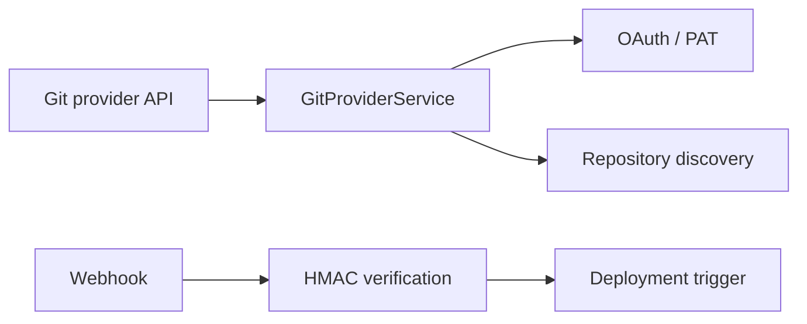

# Rustploy Git Provider Integration Architecture

```text
┌─ GIT PROVIDER ────────────────────────────────────────────┐
│ OAuth/PAT → provider client → repos/branches               │
│ webhook secret → signature verification → deployment       │
│ tokens are stored through provider repositories            │
└───────────────────────────────────────────────────────────┘
```



The **Git Provider Service** manages OAuth 2.0 authorization, Personal Access Token (PAT) authentication, repository discovery, branch listing, and webhook signature verification across 4 Git providers (`GitProviderType`: `GITHUB`, `GITLAB`, `GITEA`, `BITBUCKET`).

---

## 1. Architecture Overview

```
                      ┌───────────────────────────────┐
                      │     GitProviderController     │
                      │    (/api/git-providers/...)   │
                      └───────────────┬───────────────┘
                                      │
                                      ▼
                      ┌───────────────────────────────┐
                      │      GitProviderService       │
                      └───────────────┬───────────────┘
                                      │
      ┌──────────────────┬────────────┴─────────────┬──────────────────┐
      ▼                  ▼                          ▼                  ▼
┌──────────────┐ ┌──────────────┐          ┌──────────────┐   ┌──────────────┐
│ OAuth 2.0    │ │ Repository & │          │ Git Provider │   │ Webhook HMAC │
│ Handshake    │ │ Branch Sync  │          │ Type Enum    │   │ Validator    │
└──────────────┘ └──────────────┘          └──────────────┘   └──────────────┘
                                                    │
     ┌──────────────────────┬───────────────────────┼──────────────────────┐
     ▼                      ▼                       ▼                      ▼
┌──────────┐           ┌──────────┐            ┌──────────┐           ┌──────────┐
│  GitHub  │           │  GitLab  │            │  Gitea   │           │Bitbucket │
└──────────┘           └──────────┘            └──────────┘           └──────────┘
```

---

## 2. Detailed Internal Working Mechanism

Git Provider integration executes through a 5-phase pipeline:

```
[1. OAuth Redirect] ──► Authorization URL Built ──► Browser Redirect to Git Provider
                             │
[2. Code Exchange]  ──► Auth Code Exchanged for OAuth Access/Refresh Token
                             │
[3. Provider Store] ──► Encrypted Tokens Saved in Provider DB (`github_providers`, etc.)
                             │
[4. Discovery Sync] ──► Typed REST Client Fetches User Repositories & Branches
                             │
[5. Webhook Setup]  ──► Automated HMAC Secret Registration on Repository Push
```

### Phase 1: OAuth Redirect & Authorization (`oauth.rs`)
1. User selects provider type (`GitProviderType::Github`, `Gitlab`, `Gitea`, or `Bitbucket`).
2. `GitProviderService::authorization` builds provider-specific OAuth2 authorization URL with requested scopes (`repo`, `read:user`, `write:repo_hook`).

### Phase 2: Code Exchange & Token Issuance (`oauth.rs`)
1. Provider redirects back with `code` and `state`.
2. Exchanges authorization code for OAuth access token, refresh token, and token expiration timestamp.

### Phase 3: Typed Provider Storage (`mutations.rs`)
Stores provider configurations in engine-specific tables:
- `git_providers`: Base provider record linked to Organization.
- `github_providers` / `gitlab_providers` / `gitea_providers` / `bitbucket_providers`: Provider-specific tokens, client IDs, and secrets.

### Phase 4: Repository Discovery & Branch Fetch (`discovery.rs`)
Uses type-safe `GitProviderType` client adapters:
1. `access()` parses `GitProviderType` and selects HTTP API client.
2. `list_repositories`: Fetches user & organization repositories with pagination.
3. `list_branches`: Fetches active Git branches for a selected repository.

### Phase 5: Webhook Signature Verification (`webhooks.rs`)
1. Automatically registers repository webhooks for auto-deployments.
2. Verifies incoming webhook request signatures using HMAC-SHA256 headers (`x-hub-signature-256` for GitHub, `x-gitlab-token` for GitLab).

---

## 3. Supported Git Providers (`GitProviderType`)

- **`GitHub`** (`https://api.github.com`): OAuth2 & Personal Access Tokens.
- **`GitLab`** (`https://gitlab.com` or Self-hosted GitLab instances): OAuth2 & Personal Access Tokens.
- **`Gitea`** (Self-hosted Gitea / Forgejo instances): OAuth2 & Access Tokens.
- **`Bitbucket`** (`https://api.bitbucket.org`): OAuth2 & Workspace Tokens.

---

## 4. Database Schema & Models

### 4.1 `git_providers` Table
- `id` (INTEGER PRIMARY KEY)
- `name` (TEXT NOT NULL)
- `provider_type` (TEXT NOT NULL): `'GITHUB'`, `'GITLAB'`, `'GITEA'`, `'BITBUCKET'`.
- `organization_id` (INTEGER REFERENCES organization(id)).
- `created_at` (INTEGER DEFAULT (unixepoch())).

### 4.2 Detail Tables

## 5. How provider differences are contained

The service exposes one internal provider API for repository discovery, branch listing, OAuth/PAT configuration, and webhook setup. Provider-specific URL shapes, headers, pagination, and token exchange remain inside the corresponding client implementation.

Provider metadata and credentials are persisted through repositories. Applications reference a provider record instead of copying tokens. Disconnect/delete operations check resource usage so an in-use provider cannot silently break deployments.

Webhook secrets are generated and retrieved through repository methods, then consumed by the webhook verifier using the provider's signature format.
- `github_providers`, `gitlab_providers`, `gitea_providers`, `bitbucket_providers`: Stores `access_token`, `refresh_token`, `expires_at`, `client_id`, `client_secret`.
