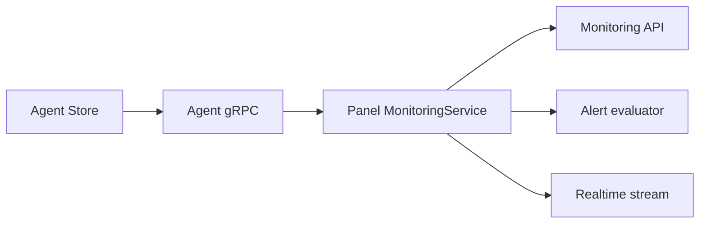

# Rustploy Monitoring & Metrics Service Architecture

```text
┌─ MONITORING ──────────────────────────────────────────────┐
│ panel auth metadata ──gRPC/token──> remote agent           │
│ agent Store owns metric SQLite and all metric SQL          │
│ panel receives DTOs, evaluates alerts, exposes API/SSE     │
└───────────────────────────────────────────────────────────┘
```



The **Monitoring Service** handles remote agent token authentication, gRPC metrics ingestion, container log streaming, server resource historical tracking (CPU, RAM, Disk, IO), and automated alert policy evaluation.

---

## 1. Architecture Overview

```
                        ┌───────────────────────────────┐
                        │     MonitoringController      │
                        │    (/api/monitoring/...)      │
                        └───────────────┬───────────────┘
                                        │
                                        ▼
                        ┌───────────────────────────────┐
                        │       MonitoringService       │
                        └───────────────┬───────────────┘
                                        │
        ┌───────────────────────────────┼───────────────────────────────┐
        ▼                               ▼                               ▼
┌───────────────────────┐   ┌───────────────────────┐   ┌───────────────────────┐
│ MonitoringAgentAuth   │   │  gRPC Metric Client   │   │ Alert Rule Evaluator  │
│ (Token Hash Repo)     │   │ (Tonic / Port 50051)  │   │ (Threshold Guard)     │
└───────────────────────┘   └───────────┬───────────┘   └───────────────────────┘
                                        │
                                        ▼
                            ┌───────────────────────┐
                            │ Remote Monitoring     │
                            │ Agent (rustploy-monitor)│
                            └───────────────────────┘
```

---

## 2. Detailed Internal Working Mechanism

The Monitoring Engine operates through a 5-phase execution pipeline:

```
[1. Token Gen]      ──► Server Token Generated (`rma_...`) ──► DB `monitoring_agents` Save
                             │
[2. Agent Launch]   ──► Deploy `rustploy-monitor` container with `METRICS_TOKEN` Env
                             │
[3. gRPC Connection]──► Tonic channel to the resolved server host on port `50051` + `x-metrics-token`
                             │
[4. Metrics Pull]   ──► Stream Server History (CPU%, RAM%, Disk%) & Container Stats
                             │
[5. Alert Evaluation]─► Compare Metrics vs Alert Rules ──► Trigger Notification Dispatch
```

### Phase 1: Agent Token Generation & Storage (`agent_auth.rs`)
1. Generates a cryptographically random token (`rma_...`) for each registered server node.
2. `MonitoringAgentRepository` stores the `query_token` (used in gRPC headers) and `token_hash` (SHA-256 hash) in the `monitoring_agents` SQLite database table.

### Phase 2: Remote Agent Container Launch (`setup/server.rs`)
1. Provisions the remote VPS node over SSH.
2. Launches `rustploy-monitor` container on port `50051` passing `SERVER_ID` and `METRICS_TOKEN` environment variables.

### Phase 3: Authenticated gRPC Client Request (`monitoring_service.rs`)
1. The panel resolves the server host, preferring its configured active private-network host when available.
2. It establishes a Tonic gRPC channel to that host on port `50051`.
3. Injects `x-metrics-token` HTTP/2 header into gRPC metadata.
4. Remote agent interceptor verifies `x-metrics-token` header against local `METRICS_TOKEN`.

### Phase 4: Metrics Ingestion & History Tracking (`monitoring_service.rs`)
1. Ingests CPU utilization, RAM usage, Disk I/O, Network I/O, and Container process metrics.
2. Stores history in SQLite time-series tables for graph rendering in the panel UI.

### Phase 5: Automated Alert Policy Evaluation (`alert_rule.rs`)
1. Compares incoming metrics against user-defined alert rules (e.g. `CPU_PERCENT > 85% for 5 minutes`).
2. If threshold is breached, triggers `NotificationService::notify(HighCpu, message)`.

---

## 3. gRPC Methods Overview (`monitoring.proto`)

- `GetServerMetrics(ServerMetricsRequest)` $\rightarrow$ Returns host CPU, RAM, Disk usage, load average, and uptime.
- `GetContainerMetrics(ContainerMetricsRequest)` $\rightarrow$ Returns per-container CPU%, RAM usage, net IO, and block IO.
- `StreamLogs(LogStreamRequest)` $\rightarrow$ Streams live container stdout/stderr log chunks over gRPC server streaming response.

---

## 4. Database Schema & Models

### 4.1 `monitoring_agents` Table
- `id` (INTEGER PRIMARY KEY)
- `server_id` (INTEGER UNIQUE REFERENCES servers(id) ON DELETE CASCADE)
- `organization_id` (INTEGER REFERENCES organization(id))
- `query_token` (TEXT NOT NULL)
- `token_hash` (TEXT NOT NULL)
- `created_at` (INTEGER DEFAULT (unixepoch())).

### 4.2 `alert_rules` Table

## 5. How the panel/agent boundary works

Metric SQL is owned by the agent. `agent/src/store.rs` creates the agent-local SQLite schema, writes samples, applies retention, and serves historical rows. `agent/src/grpc.rs` calls those Store methods and exposes protobuf responses.

The panel never opens the agent database. `src/services/monitoring/monitoring_service.rs` resolves the panel-side query token, adds it to gRPC metadata, calls the metric RPCs, and maps protobuf values to panel DTOs. Panel SQL in `agent_auth.rs` is only registration, organization ownership, token, and last-seen metadata.

```text
agent Store (SQL) → agent gRPC (auth interceptor) → panel gRPC client
                                                   → org check
                                                   → DTO/API/SSE/alerts
```
- `id` (INTEGER PRIMARY KEY)
- `name` (TEXT NOT NULL)
- `target_kind` (TEXT NOT NULL): `'SERVER'`, `'CONTAINER'`.
- `metric_name` (TEXT NOT NULL): `'CPU_PERCENT'`, `'MEMORY_PERCENT'`, `'DISK_PERCENT'`.
- `operator` (TEXT NOT NULL): `'GREATER_THAN'`, `'LESS_THAN'`.
- `threshold` (REAL NOT NULL).
- `duration_seconds` (INTEGER DEFAULT 300).
- `organization_id` (INTEGER REFERENCES organization(id)).
