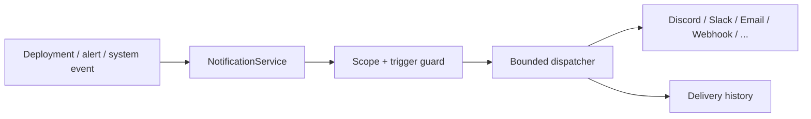
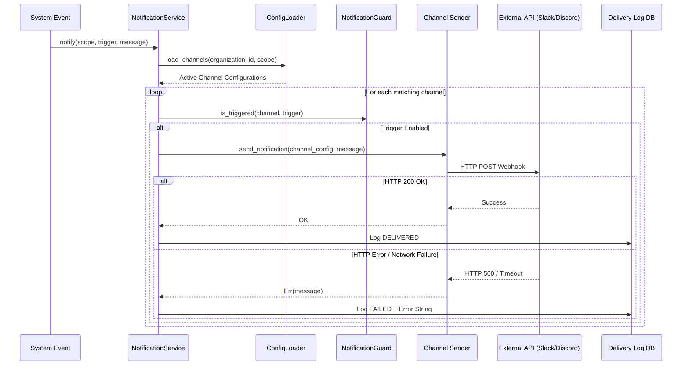

# OpenOxide Notification Service Architecture

```text
┌─ NOTIFICATIONS ───────────────────────────────────────────┐
│ event → scope/trigger filter → bounded dispatcher          │
│                    → channel sender → delivery status      │
└───────────────────────────────────────────────────────────┘
```



OpenOxide features a high-performance, multi-channel **Notification Engine** designed to dispatch event-driven alerts, deployment updates, and monitoring warnings across 13 different communication channels.

---

## 1. Architecture Overview

```
                      ┌──────────────────────────┐
                      │    Triggering Events     │
                      │ (Deploy/Build/Alert/OOM) │
                      └────────────┬─────────────┘
                                   │
                                   ▼
                      ┌──────────────────────────┐
                      │   NotificationService    │
                      └────────────┬─────────────┘
                                   │
      ┌────────────────────────────┼────────────────────────────┐
      ▼                            ▼                            ▼
┌──────────────┐          ┌──────────────────┐         ┌────────────────────┐
│ ConfigLoader │          │ Dispatch Guard   │         │ Delivery Tracking  │
│ (Fetch DB)   │          │ (Scope/Triggers) │         │ (Status & Audit)   │
└──────────────┘          └──────────────────┘         └────────────────────┘
                                   │
                                   ▼ (Concurrent Semaphore: 5)
 ┌─────────────────────────────────────────────────────────────────────────────────┐
 │                            13 Supported Channel Senders                         │
 ├──────────┬───────────┬────────────┬─────────┬───────┬────────┬──────────┬───────┤
 │ Discord  │ Slack     │ Telegram   │ Teams   │ Ntfy  │ Gotify │ Pushover │ Email │
 ├──────────┼───────────┼────────────┼─────────┴───────┴────────┴──────────┴───────┤
 │ Resend   │ Lark      │ Mattermost │ Webhook / Custom HTTP                       │
 └──────────┴───────────┴────────────┴─────────────────────────────────────────────┘
```

---

## 2. Detailed Internal Working Mechanism

The Notification Engine executes through a strict 5-phase async pipeline:

```
[1. Event Trigger]   ──► System Event (Deployment/Alert) ──► Payload Construction
                              │
[2. Scope Filtering] ──► ConfigLoader Fetches Channels (Global / Project / Server)
                              │
[3. Rate Limit Guard]──► Tokio Semaphore Permit Claim (Max 5 Concurrently)
                              │
[4. Channel Send]    ──► Provider Format (Slack Blocks / Discord Embeds / Bot HTML)
                              │
[5. Audit Logging]   ──► Delivery Result Logged ('DELIVERED' or 'FAILED' Traceback)
```

### Phase 1: Event Triggering & Payload Assembly (`trigger.rs` & `message.rs`)
1. An event occurs in the system (e.g. `DeploymentFailure`, `HighCpu`, `BackupFailure`).
2. `NotificationMessage::builder()` formats a rich event payload with titles, status colors, timestamps, and actionable URLs.

### Phase 2: Scope & Channel Resolution (`loader.rs` & `scope.rs`)
1. `NotificationConfigLoader` fetches active notification configurations from database.
2. Filters channels based on `NotificationScope` (`Global`, `Project`, `Application`, `Server`, `Database`).
3. Evaluates `NotificationGuard`: Verifies if the specific channel enabled the current event trigger type.

### Phase 3: Concurrency Control & Rate Limiting (`service.rs`)
1. Claims an asynchronous execution permit from `tokio::sync::Semaphore` (max 5 parallel dispatches).
2. Prevents hitting external rate limits (e.g. Discord 5 req/sec, Telegram API limits) or overloading customer webhooks.

### Phase 4: Channel-Specific Formatting & HTTP Dispatch (`senders/`)
1. Dispatches the notification to the target channel sender module:
   - **Slack**: Formats Block Kit JSON.
   - **Discord**: Formats color-coded rich embed payload.
   - **Telegram**: Formats HTML/Markdown bot API payload.
   - **Email / Resend**: Formats HTML email template.
2. Sends HTTP POST request using pooled `reqwest::Client` with strict timeouts (5s connect, 10s total).

### Phase 5: Delivery Auditing & Error Persistence (`delivery.rs`)
1. **On HTTP 200 OK**: Writes delivery log entry in `notification_delivery` with `status = 'DELIVERED'`.
2. **On HTTP 500 / Network Timeout**: Captures detailed network error traceback and logs entry with `status = 'FAILED'` and error string.

---

## 3. Supported Channels & Senders (13 Channels)

1. **Slack**: Incoming webhook integration formatted with Block Kit cards.
2. **Discord**: Rich embed messages with color-coded status pills (Green = Success, Red = Failure).
3. **Telegram**: Bot API dispatch (`sendMessage` with HTML/Markdown parsing).
4. **Microsoft Teams**: Office 365 Connector ActionCard / AdaptiveCard format.
5. **Ntfy.sh**: HTTP pub/sub push notifications with custom priority tags.
6. **Gotify**: Self-hosted notification server integration.
7. **Pushover**: Mobile push notification API with customizable sound tags.
8. **Email (SMTP)**: Native SMTP email delivery via TLS.
9. **Resend**: Modern transactional HTTP Email API.
10. **Lark / Feishu**: Interactive card webhook format.
11. **Mattermost**: Native chat webhook integration.
12. **Webhook**: Generic JSON HTTP POST payload dispatcher.
13. **Custom HTTP**: Fully custom header and template HTTP POST dispatcher.

---

## 4. Scopes & Triggers

### 4.1 Scopes (`NotificationScope`)
Filters notification delivery based on resource context:
- `Global`: Receives events across the entire organization.
- `Project`: Scoped to events originating from a specific Project.
- `Application`: Scoped to a single Application (e.g. build failure).
- `Server`: Scoped to a specific VPS (e.g. CPU spike, Disk full).
- `Database`: Scoped to database backups or failures.

### 4.2 Triggers (`NotificationTrigger`)
- `DeploymentSuccess`: Triggered when an application or compose stack deploys successfully.
- `DeploymentFailure`: Triggered when a deployment fails.
- `BuildFailure`: Triggered when a Docker build or compile step fails.
- `ContainerDown`: Triggered when a container crashes or exits unexpectedly.
- `HighCpu` / `HighMemory` / `HighDisk`: Monitoring threshold breaches.
- `CertificateExpiration`: SSL/TLS renewal warnings.
- `BackupFailure`: Database or volume backup execution failure.

---

## 5. Database Schema & Models

### 5.1 `notifications` Table
Stores channel configuration metadata.
- `id` (INTEGER PRIMARY KEY)
- `name` (TEXT NOT NULL): Channel label (e.g. "DevOps Slack Channel").
- `notification_type` (TEXT NOT NULL): Provider identifier (`'SLACK'`, `'DISCORD'`, `'TELEGRAM'`, etc.).
- `is_enabled` (INTEGER DEFAULT 1).
- `scope_type` (TEXT NOT NULL): `'GLOBAL'`, `'PROJECT'`, `'APPLICATION'`, etc.
- `scope_id` (INTEGER NULLABLE).
- `organization_id` (INTEGER REFERENCES organization(id)).

### 5.2 Provider Detail Tables
Dedicated configuration tables per channel (e.g. `notification_slack_providers`, `notification_telegram_providers`).

### 5.3 `notification_delivery` Table
Stores historical delivery logs.
- `id` (INTEGER PRIMARY KEY)
- `notification_id` (INTEGER REFERENCES notifications(id))
- `status` (TEXT NOT NULL): `'DELIVERED'`, `'FAILED'`.
- `error` (TEXT NULLABLE): Error message if delivery failed.
- `delivered_at` (INTEGER DEFAULT (unixepoch())).

---

## 6. Notification Dispatch Sequence Diagram

## 7. How notification delivery works

Callers construct a channel-neutral `NotificationMessage` and trigger. `NotificationService` loads organization/user configurations through repositories, filters disabled channels and unmatched scopes/triggers, then dispatches using a bounded concurrency limit so a burst of alerts cannot spawn unlimited outbound requests.

Every sender owns only protocol formatting and transport: Slack blocks, Discord embeds, SMTP, Resend, Telegram, Teams, ntfy, Gotify, and generic webhooks all receive the same logical message. Delivery success/failure is recorded independently; one failed channel does not discard successful deliveries to other channels.

Secrets remain in provider-specific configuration rows and are never embedded in execution logs.


