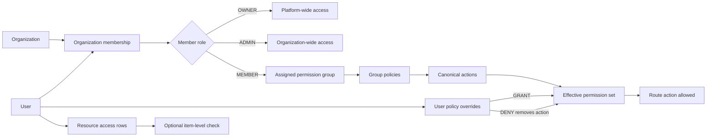
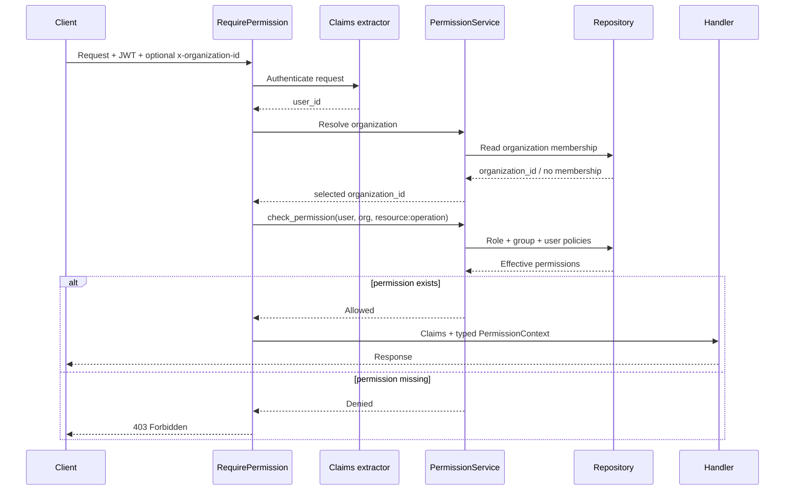
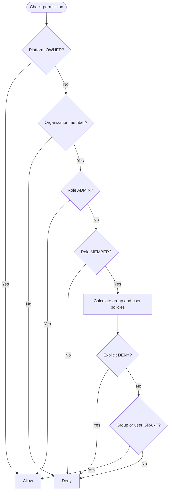
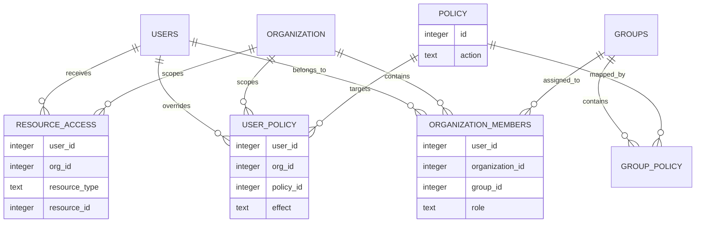
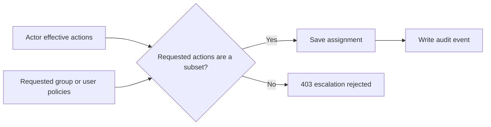

# OpenOxide permissions

OpenOxide uses organization-scoped, typed permission checks. A request is allowed only when the authenticated user belongs to the selected organization and has the action required by the route.

The system has three separate concepts:

1. **Membership** — which organizations the user belongs to.
2. **Permission groups** — reusable collections of policy actions assigned to members.
3. **Explicit user policies** — `GRANT` or `DENY` exceptions for one member.

Resource-level access (`resource_access`) is a separate repository/API primitive for item scoping. It is not automatically applied by the route extractor; a service that needs item-level restrictions must call `PermissionService::check_resource_access` explicitly.

## Architecture at a glance



In short: membership selects the organization, the role chooses the evaluation path, groups provide reusable permissions, and user policies add or remove exceptions.

## Request flow



The implementation lives in:

- `src/core/middleware/permission/` — typed route guard and rejection mapping.
- `src/services/permission/` — permission resolution and group/delegation rules.
- `src/db/repository/` — all permission SQL.
- `src/api/handlers/permission.rs` — group, member, invite and policy APIs.

## Typed route guards

Routes declare permissions at compile time:

```rust
use crate::core::middleware::permission::{CanDeploy, RequirePermission, Application};

RequirePermission<Application, CanDeploy>
```

This resolves to the canonical action:

```text
app:deploy
```

The resource and operation must be registered in `src/services/permission/types.rs`, and the pair must be permitted in `src/core/middleware/permission/rules.rs`:

```rust
allow!(Application: CanRead, CanCreate, CanUpdate, CanDelete, CanDeploy, CanMonitor);
```

Therefore invalid combinations fail at compile time instead of becoming unprotected string-based routes.

## Organization selection

The extractor first checks the `x-organization-id` request header. If it is absent, it uses `PermissionService::resolve_organization`, which returns the user's first organization membership.

The organization ID is placed into request extensions as `PermissionOrganization` and is also available from the typed context:

```rust
RequirePermission(_claims, permission): RequirePermission<Server, CanRead>
let organization_id = permission.organization_id();
```

Handlers that access a resource by ID must still verify that resource belongs to this organization. The permission guard authenticates the action; it does not infer ownership of arbitrary IDs.

## Permission resolution

`PermissionService::check_permission` evaluates permissions in this order:

1. **Platform owner** — a user with role `OWNER` is allowed globally.
2. **Membership** — the user must be a member of the requested organization.
3. **Organization admin** — a member with role `ADMIN` is allowed all actions in that organization.
4. **Member policies** — a `MEMBER` receives permissions from assigned group policies and direct user overrides.
5. **Default deny** — missing actions return `403 Forbidden`.



The effective group query combines policies assigned through `organization_members → group_policy → policy` with direct user overrides. A `DENY` action is removed after grants are collected, so it wins over a group grant.

```text
group GRANT + user GRANT = allowed
group GRANT + user DENY  = denied
group missing + user GRANT = allowed
group missing + no override = denied
```

## Database model



Important tables:

- `organization_members` — one membership per user and organization; stores role and assigned group.
- `groups` — system or organization-owned permission groups.
- `policy` — canonical action catalog such as `server:read` and `app:deploy`.
- `group_policy` — many-to-many group/action mapping.
- `user_policy` — explicit `GRANT`/`DENY` action overrides.
- `resource_access` — optional item-level grants.

All SQL is repository-owned. Services call repositories and do not query these tables directly.

## Groups and delegation

An organization can create custom groups and assign policies to them. System groups are protected and cannot be edited or deleted as normal organization groups.

When a member creates a group, invites a user, assigns a group, or replaces user policies, `PermissionGroupService` verifies that the requested actions are a subset of the actor's effective permissions. This prevents privilege escalation:



```text
Actor permissions: app:read, app:deploy
Requested group:  app:read, app:deploy   ✅ allowed
Requested group:  server:delete           ❌ rejected
```

Relevant service error:

```text
permission delegation exceeds the actor's permissions
```

The owner/admin policy APIs also write audit events for group, member, policy and invitation changes.

## Resource-level access

Use resource access when an action is valid generally but must be restricted to selected items:

```rust
let allowed = permission_service
    .check_resource_access(user_id, organization_id, ResourceType::Server, server_id)
    .await?;
```

Platform owners bypass this check. Other users need a matching row in `resource_access`. A service should perform this check after the route permission guard and before mutating or returning the specific resource.

## API examples

The permission controller exposes operations for:

- listing available policies and groups;
- creating, updating and deleting organization groups;
- assigning a group to an organization member;
- replacing a member's direct `GRANT`/`DENY` policies;
- creating, listing, cancelling and accepting organization invitations.

Every endpoint is itself protected with a typed permission, for example:

```rust
RequirePermission<Groups, CanCreate>
RequirePermission<Members, CanUpdate>
RequirePermission<Invitation, CanCreate>
```

## Adding a new permission

1. Add the resource or operation to `src/services/permission/types.rs`.
2. Add valid resource/operation pairs to `src/core/middleware/permission/rules.rs`.
3. Insert the action into a migration under `db/migrations/` and mirror the current schema under `db/schema/`.
4. Protect the route with `RequirePermission<Resource, Operation>`.
5. Add organization ownership checks for any resource ID in the request.
6. Add tests for owner, admin, group grant, explicit deny, missing membership and cross-organization access.

## Security rules

- Never trust an organization ID from the URL/body without comparing it to the permission context.
- Never use a user's global/default group ID as the organization scope; use the organization membership record.
- Keep permission SQL in repositories.
- Treat `DENY` as stronger than any grant.
- Do not let a member assign actions they do not already possess.
- Return `403` for a valid request lacking permission and `401` for missing/invalid authentication.

## How the implementation was made safe

The main multi-organization risk is checking only a user's role and forgetting the organization or resource being requested. OpenOxide fixes that at two layers: `RequirePermission` establishes one canonical organization context, and handlers/services verify that the target resource belongs to that organization.

The second risk is privilege delegation. Group and policy mutations go through `PermissionGroupService`, which loads the actor's effective actions and rejects any requested group or override that is not a subset. Repository methods constrain organization-owned groups and protect system groups. Audit events are emitted after successful permission, member, and invite changes.

## Legacy access removal

The temporary `permission_legacy_full_access` compatibility bypass has been removed. Existing users no longer receive implicit full access merely because their account predates permission enforcement.

Migration `0044_remove_legacy_permission_access.sql` removes the compatibility table from upgraded databases. After this migration, every authorization decision follows the same explicit rules:

```text
platform OWNER
    OR organization ADMIN
    OR MEMBER with an effective granted action
```

This makes permission behavior predictable and prevents an old account from silently bypassing organization policies.
