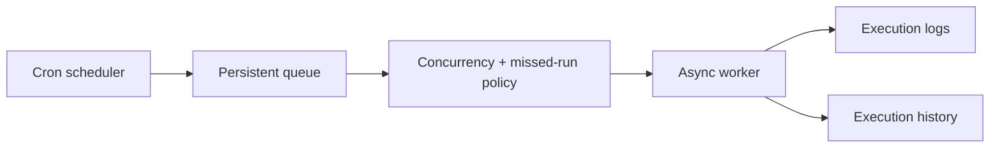

# Rustploy Background Queue & Scheduler Architecture

```text
┌─ BACKGROUND ──────────────────────────────────────────────┐
│ due job → policy check → queue → bounded worker             │
│ duplicate hit → ALLOW / FORBID / REPLACE                   │
│ result → execution log file + database history + notify    │
└───────────────────────────────────────────────────────────┘
```



This document details the Background Queue Engine and Cron Scheduler built into Rustploy.

---

## 1. Architecture Overview

```
                      ┌───────────────────────────────┐
                      │    Background Scheduler Loop  │
                      │    (Tokio Async Sleep Loop)   │
                      └───────────────┬───────────────┘
                                      │
                                      ▼
                      ┌───────────────────────────────┐
                      │      ScheduleRepository       │
                      │   (Fetch Due Cron Tasks)      │
                      └───────────────┬───────────────┘
                                      │
      ┌──────────────────┬────────────┴─────────────┬──────────────────┐
      ▼                  ▼                          ▼                  ▼
┌──────────────┐ ┌──────────────┐          ┌──────────────┐   ┌──────────────┐
│ Missed Run   │ │ Concurrency  │          │ Cron Expression│  │ Async Task   │
│ Policy Guard │ │ Policy Guard │          │ Evaluator    │   │ Execution    │
│(SKIP/RUN_ONCE) │(FORBID/ALLOW)│          │ (5-field)    │   │ (Worker)     │
└──────────────┘ └──────────────┘          └──────────────┘   └──────────────┘
```

---

## 2. Queue & Concurrency Policies

### 2.1 Missed Run Policy (`MissedRunPolicy`)
When the server restarts or recovers from downtime:
- **`SKIP`**: Ignores all missed executions during the downtime and calculates the next future cron timestamp.
- **`RUN_ONCE`**: Executes one immediate catch-up run before returning to the normal schedule.

### 2.2 Concurrency Policy (`ConcurrencyPolicy`)
When a scheduled job's previous execution is still running:
- **`FORBID`**: Skips the new execution to prevent thread/resource exhaustion.
- **`ALLOW`**: Runs the new task concurrently alongside the active task.
- **`REPLACE`**: Cancels the running task via Tokio cancellation token and spawns the new task.

---

## 3. Supported Task Triggers (`ScheduleTriggerKind`)

## 4. How this is solved in the codebase

The scheduler is split into persistence, decision-making, and execution. The repository reads due rows and records attempts; the runner converts a due row into a queue operation instead of doing deployment work inside the cron tick. A slow backup or deployment therefore cannot block the next scheduler tick.

```text
tick
 └─ repository: find due schedules
     └─ runtime: missed-run + concurrency decision
         ├─ SKIP / FORBID: record why it was not started
         ├─ RUN_ONCE / ALLOW: enqueue one execution
         └─ REPLACE: cancel/finish old execution, enqueue newest
```

Each execution has durable status and timestamps, so a restart can distinguish a completed job from a job that was only claimed. Output is streamed while running and persisted with the execution record.

1. **`BACKUP`**: Automated scheduled database and volume backups.
2. **`DEPLOYMENT`**: Scheduled application re-deployments and image pulls.
3. **`COMMAND`**: Scheduled remote shell command / maintenance script executions.
