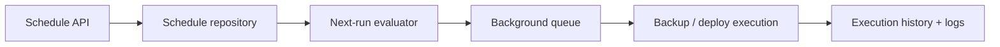

# OpenOxide Scheduled Cron Job Engine Architecture

```text
┌─ SCHEDULE ─────────────────────────────────────────────────┐
│ cron expression → next run → queue                         │
│ concurrency: ALLOW / FORBID / REPLACE                      │
│ missed run: SKIP / RUN_ONCE → execution history            │
└───────────────────────────────────────────────────────────┘
```



The **Schedule Service** in OpenOxide provides automated cron job scheduling, missed execution policies (`SKIP`, `RUN_ONCE`), concurrency handling (`ALLOW`, `FORBID`, `REPLACE`), and scheduled backup/deployment execution.

---

## 1. Architecture Overview

```
                        ┌───────────────────────────────┐
                        │      ScheduleController       │
                        │    (/api/schedules/...)       │
                        └───────────────┬───────────────┘
                                        │
                                        ▼
                        ┌───────────────────────────────┐
                        │        ScheduleService        │
                        └───────────────┬───────────────┘
                                        │
        ┌───────────────────────────────┼───────────────────────────────┐
        ▼                               ▼                               ▼
┌───────────────────────┐   ┌───────────────────────┐   ┌───────────────────────┐
│ Cron Parser &         │   │ Concurrency Policy    │   │ Execution History     │
│ Next Run Evaluator    │   │ (FORBID/ALLOW/REPLACE)│   │ (Schedule Executions) │
└───────────────────────┘   └───────────┬───────────┘   └───────────────────────┘
                                        │
                                        ▼
                            ┌───────────────────────┐
                            │ Trigger Task Runner   │
                            │ (Backup / Deploy)     │
                            └───────────────────────┘
```

---

## 2. Detailed Internal Working Mechanism

The Schedule Engine executes through a 5-phase background processing loop:

```
[1. Cron Tick]      ──► Tokio Sleep Interval ──► Query Active Schedules Due (`next_run_at`)
                             │
[2. Missed Run Check]─► Evaluate `missed_run_policy` ('SKIP' or 'RUN_ONCE')
                             │
[3. Concurrency Guard]► Evaluate `concurrency_policy` ('FORBID' blocks if running)
                             │
[4. Task Execution] ──► Trigger Backup / Application Deploy / Script Execution
                             │
[5. Reschedule]     ──► Compute Next `cron_expression` Timestamp ──► Log Output in DB
```

### Phase 1: Background Cron Tick (`schedule.rs`)
1. Runs an asynchronous background loop waking up every 5-10 seconds.
2. Queries SQLite table `schedules` for active tasks where `is_enabled = 1` AND `next_run_at <= unixepoch()`.

### Phase 2: Missed Execution Handling (`types.rs`)
Evaluates `missed_run_policy` if panel server was offline during scheduled time:
- **`SKIP`**: Discards missed runs and schedules for the next future cron occurrence.
- **`RUN_ONCE`**: Executes one catch-up run immediately before resuming normal schedule.

### Phase 3: Concurrency Control (`types.rs`)
Evaluates `concurrency_policy` if previous run is still active:
- **`FORBID`**: Skips execution if previous run is still in `'RUNNING'` status.
- **`ALLOW`**: Runs parallel execution alongside running task.
- **`REPLACE`**: Cancels previous active execution and starts new task.

### Phase 4: Target Task Dispatch (`schedule.rs`)
Invokes target execution task based on `trigger_kind`:
- **`BACKUP`**: Invokes `BackupService` to generate database/volume dump.
- **`DEPLOYMENT`**: Invokes `DeploymentService` to re-deploy application or compose stack.
- **`COMMAND`**: Executes custom shell script on target server node.

### Phase 5: Next Run Computation & Execution Logging (`schedule_runtime.rs`)
1. Parses standard 5-field cron expression (e.g., `0 2 * * *` for 2 AM daily).
2. Computes and updates `next_run_at` timestamp.
3. Logs execution output (`stdout`, `stderr`, `status = 'COMPLETED'` / `'FAILED'`) in `schedule_executions`.

---

## 3. Database Schema & Models

### 3.1 `schedules` Table
- `id` (INTEGER PRIMARY KEY)
- `name` (TEXT NOT NULL)
- `cron_expression` (TEXT NOT NULL)
- `trigger_kind` (TEXT NOT NULL): `'BACKUP'`, `'DEPLOYMENT'`, `'COMMAND'`.
- `missed_run_policy` (TEXT DEFAULT `'SKIP'`): `'SKIP'`, `'RUN_ONCE'`.
- `concurrency_policy` (TEXT DEFAULT `'FORBID'`): `'FORBID'`, `'ALLOW'`, `'REPLACE'`.
- `is_enabled` (INTEGER DEFAULT 1).
- `last_run_at` (INTEGER NULLABLE).
- `next_run_at` (INTEGER NOT NULL).
- `organization_id` (INTEGER REFERENCES organization(id)).

### 3.2 `schedule_executions` Table

## 4. How schedule state survives restarts

The database stores the cron expression, timezone, next-run timestamp, missed-run policy, concurrency policy, target kind/ID, and enabled state. On startup the runner registers enabled schedules and reconciles persisted timing instead of assuming the process was always online.

Before starting work it writes an execution record and applies `ALLOW`, `FORBID`, or `REPLACE` against active executions. The actual target is dispatched through the existing deployment/backup service, so schedule execution cannot bypass normal validation or queue limits. Completion stores timestamps, status, error, and log location.
- `id` (INTEGER PRIMARY KEY)
- `schedule_id` (INTEGER REFERENCES schedules(id) ON DELETE CASCADE)
- `status` (TEXT NOT NULL): `'RUNNING'`, `'COMPLETED'`, `'FAILED'`.
- `stdout` (TEXT NULLABLE)
- `stderr` (TEXT NULLABLE)
- `scheduled_at` (INTEGER NOT NULL)
- `finished_at` (INTEGER NULLABLE).
