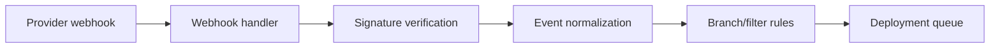
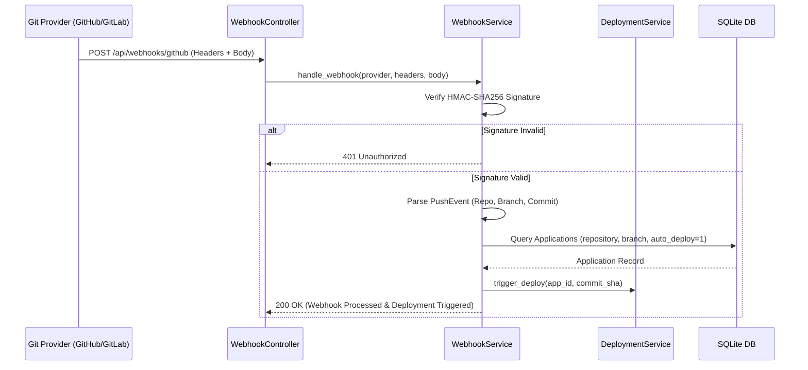

# OpenOxide Webhook Engine Architecture

```text
┌─ WEBHOOK ─────────────────────────────────────────────────┐
│ receive → identify provider → verify HMAC → normalize event │
│                 → branch match → enqueue deployment         │
└─────────────────────────────────────────────────────────────┘
```



The **Webhook Service** handles incoming Git repository push and pull request webhooks, HMAC signature verification, branch matching, and automated trigger deployments.

---

## 1. Architecture Overview

```
                      ┌───────────────────────────────┐
                      │       WebhookController       │
                      │     (/api/webhooks/...)       │
                      └───────────────┬───────────────┘
                                      │
                                      ▼
                      ┌───────────────────────────────┐
                      │        WebhookService         │
                      └───────────────┬───────────────┘
                                      │
      ┌──────────────────┬────────────┴─────────────┬──────────────────┐
      ▼                  ▼                          ▼                  ▼
┌──────────────┐ ┌──────────────┐          ┌──────────────┐   ┌──────────────┐
│ Header Event │ │ HMAC Signature│         │ Git Event    │   │ Auto-Deploy  │
│ Extractor    │ │ Verification │          │ Normalizer   │   │ Dispatcher   │
└──────────────┘ └──────────────┘          └──────────────┘   └──────────────┘
```

---

## 2. Detailed Internal Working Mechanism

The Webhook Engine executes through a 5-phase security pipeline:

```
[1. Webhook Post]   ──► Webhook Endpoint Invoked + Provider Detected (`GitHub`/`GitLab`)
                             │
[2. Signature Check]──► HMAC-SHA256 Signature Verified against Secret (`x-hub-signature-256`)
                             │
[3. Event Normalize]──► Parse `PushEvent` or `PullRequestEvent` (Owner, Repo, Branch, Commit)
                             │
[4. Target Match]   ──► Match Target Application / Compose Project by Repository & Branch
                             │
[5. Auto-Deploy]    ──► Trigger `DeploymentService` / `PreviewDeploymentService`
```

### Phase 1: Endpoint Invocation & Header Parsing (`mod.rs`)
1. Receives HTTP POST request at `/api/webhooks/{provider}`.
2. Identifies provider type via URL path or HTTP headers:
   - **GitHub**: Header `x-github-event`.
   - **GitLab**: Header `x-gitlab-event`.
   - **Gitea**: Header `x-gitea-event`.
   - **Bitbucket**: Header `x-event-key`.

### Phase 2: HMAC Signature Verification (`webhooks.rs`)
1. Extracts raw request body bytes.
2. Computes HMAC-SHA256 signature using stored webhook secret key.
3. Compares signature using constant-time comparison to prevent timing attacks.
4. If signature fails, aborts request immediately with `HTTP 401 Unauthorized`.

### Phase 3: Event Normalization (`types.rs`)
Parses raw JSON payload into normalized Rust structs:
- **`PushEvent`**: `provider`, `trigger` (`PUSH` / `TAG`), `owner`, `repository`, `branch`, `commit_sha`, `changed_paths`.
- **`PullRequestEvent`**: `provider`, `owner`, `repository`, `number`, `action` (`opened`, `synchronize`, `closed`), `source_branch`, `target_branch`.

### Phase 4: Target Application Matching (`service.rs`)
1. Searches SQLite database for Applications or Compose Projects matching:
   - `repository = owner/repo`
   - `branch = target_branch`
   - `is_auto_deploy_enabled = 1`

### Phase 5: Auto-Deployment Dispatch (`service.rs`)
1. For `PushEvent`: Triggers `DeploymentService::deploy` to build and update the matching Application or Compose Stack.
2. For `PullRequestEvent`: Triggers `PreviewDeploymentService::matching_targets` to manage ephemeral preview deployments.

---

## 3. Supported Webhook Event Types

- **`PushEvent`**: Repository push or tag creation.
- **`PullRequestEvent`**: Pull request lifecycle (`opened`, `reopened`, `synchronize`, `closed`).
- **`PingEvent`**: Webhook connectivity verification ping.

---

## 4. Sequence Diagram

## 5. How webhook processing avoids unsafe deployments

The raw request is provider-specific only at the boundary. The handler extracts event/signature headers, verifies the stored webhook secret against the exact request body, and normalizes accepted events into OpenOxide's internal push/pull-request representation.

Only after signature validation does the service look up applications/Compose projects by provider, repository, and branch. A match enqueues the normal deployment operation; it never calls Docker directly from the HTTP request. Duplicate or irrelevant events therefore do not bypass queue/concurrency rules.

Pull-request lifecycle events are forwarded to preview deployment handling, while ordinary pushes use the configured auto-deploy flag and target branch.


